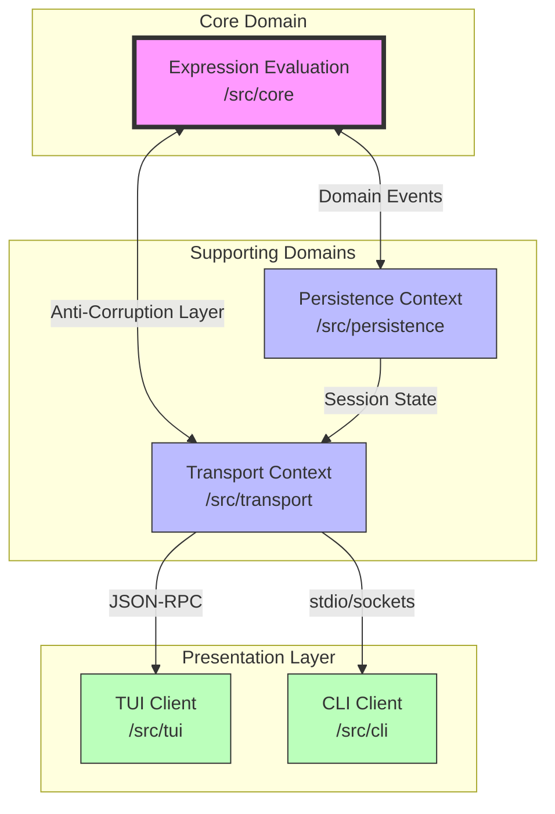
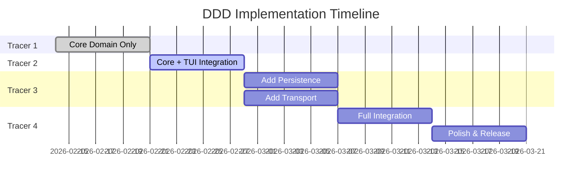
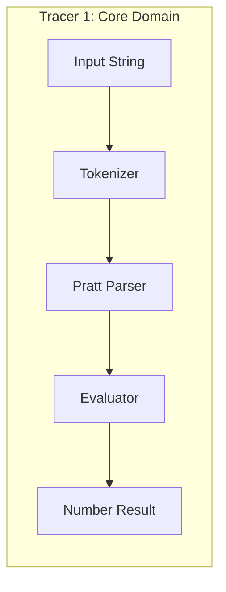
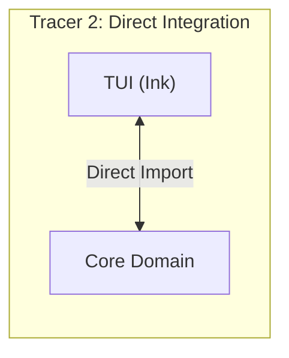
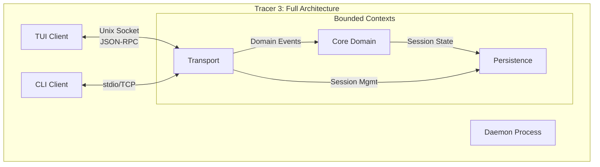
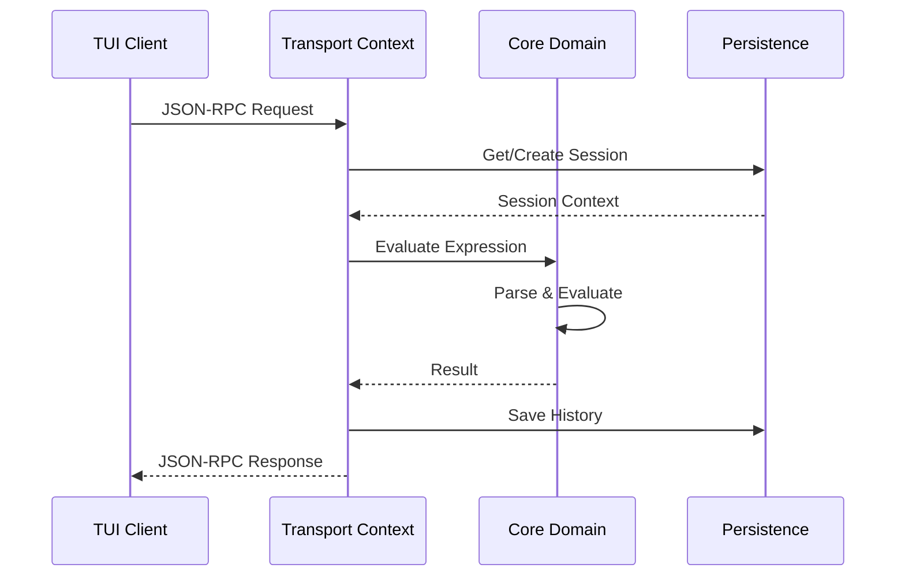
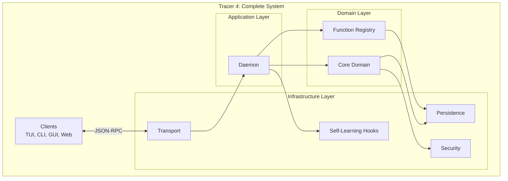
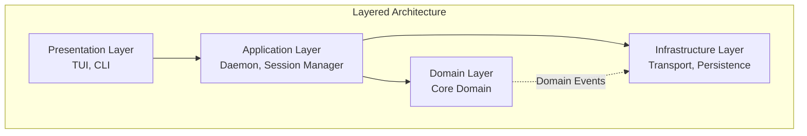
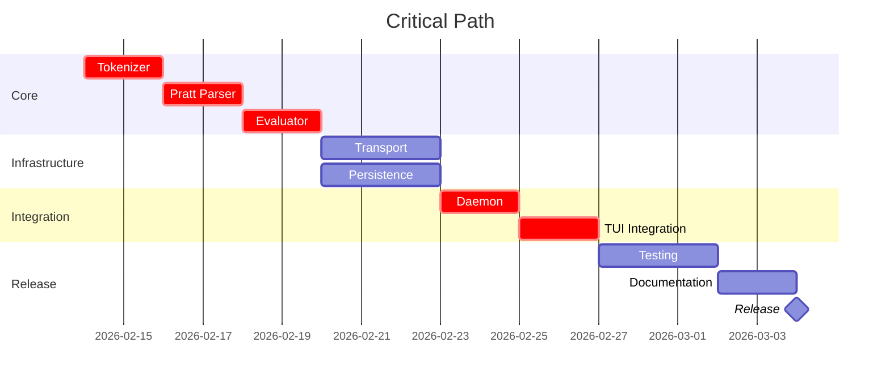
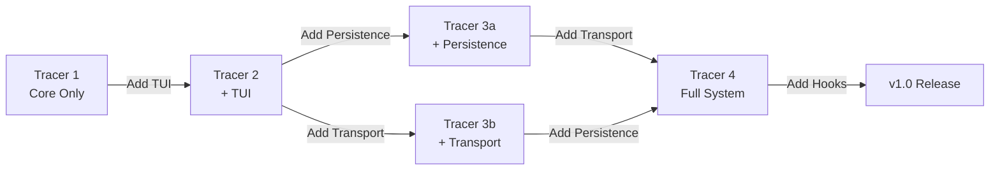

# Calculathor DDD Implementation Plan

> **Project**: Calculathor - A powerful yet lightweight calculator
> **Approach**: Domain-Driven Design with Tracer Bullet Development
> **Status**: Implementation Planning
> **Tags**: `ddd,implementation,roadmap,claude-flow`

---

## 1. Executive Summary

### 1.1 Bounded Contexts Overview

Calculathor is organized into four distinct bounded contexts following Domain-Driven Design principles:



### 1.2 Strategic Classification

| Context | Type | Priority | Complexity | Business Value |
|---------|------|----------|------------|----------------|
| **Expression Evaluation** | Core Domain | Critical | High | High - Differentiator |
| **Transport** | Supporting Domain | High | Medium | Medium - Enabler |
| **Persistence** | Supporting Domain | High | Medium | Medium - Enabler |
| **TUI/CLI** | Generic Domain | Medium | Low | Low - Delivery |

### 1.3 Key Architectural Decisions (ADRs)

| ADR | Decision | Impact on DDD |
|-----|----------|---------------|
| ADR-001 | Bun Runtime | Fast startup, single binary |
| ADR-002 | Pratt Parser | Core domain algorithm |
| ADR-003 | Hybrid Daemon | Transport architecture |
| ADR-004 | Ink TUI | Presentation layer |
| ADR-005 | Plugin Security | Core domain security |
| ADR-006 | Self-Learning Hooks | Cross-context intelligence |

---

## 2. Implementation Phases

### 2.1 Phase Overview

Implementation follows **Tracer Bullet Development** - vertical slices that deliver working functionality at each stage.



---

## 3. Tracer 1: Core Domain Only

### 3.1 Scope

**Goal**: Functional expression evaluator with no external dependencies.



### 3.2 Components to Implement

| Component | Responsibility | Files |
|-----------|---------------|-------|
| Tokenizer | Lexical analysis | `/src/core/pure/tokenizer.ts` |
| Pratt Parser | AST generation | `/src/core/pure/pratt-parser.ts` |
| Evaluator | Expression evaluation | `/src/core/pure/evaluator.ts` |
| Registry | Functions/operators | `/src/core/services/registry-service.ts` |
| CLI | Simple REPL | `/src/cli.ts` |

### 3.3 Success Criteria

- [ ] `echo "2 + 3 * 4" | bun run cli` outputs `14`
- [ ] All pure functions have unit tests
- [ ] Parser handles operator precedence correctly
- [ ] Evaluation completes in <1ms

### 3.4 No External Dependencies

```typescript
// Tracer 1 - No imports from other contexts
// src/core/pure/tokenizer.ts
export function tokenize(input: string): Token[] {
  // Pure function, no side effects
}

// src/core/pure/evaluator.ts
export function evaluate(
  ast: ASTNode,
  context: EvaluateContext
): number {
  // Pure function, no I/O
}
```

---

## 4. Tracer 2: Core Domain + TUI

### 4.1 Scope

**Goal**: Interactive TUI with direct Core Domain integration (no transport layer).



### 4.2 Integration Pattern

```typescript
// src/tui/App.tsx - Tracer 2
import { evaluateExpression } from '../core/api';

function App() {
  const handleInput = (input: string) => {
    // Direct function call - no transport
    const result = evaluateExpression(input);
    setResults([...results, { input, result }]);
  };
}
```

### 4.3 Components to Implement

| Component | Responsibility | Files |
|-----------|---------------|-------|
| App | Main TUI component | `/src/tui/App.tsx` |
| InputPanel | Syntax-highlighted input | `/src/tui/components/InputPanel.tsx` |
| ResultsPanel | History display | `/src/tui/components/ResultsPanel.tsx` |
| Core API | Public Core interface | `/src/core/api.ts` |

### 4.4 Anti-Corruption Layer

```typescript
// src/core/api.ts - Clean public interface
export interface ExpressionApi {
  evaluate(input: string): number;
  parse(input: string): ASTNode;
  registerFunction(name: string, fn: (...args: number[]) => number): void;
  registerConstant(name: string, value: number): void;
}

export class ExpressionApiImpl implements ExpressionApi {
  // Orchestrates domain services
  // Hides internal complexity
}
```

### 4.5 Success Criteria

- [ ] Interactive TUI launches with `bun run tui`
- [ ] Real-time syntax highlighting
- [ ] Results display with scrollable history
- [ ] All Tracer 1 functionality preserved

---

## 5. Tracer 3: Add Persistence + Transport

### 5.1 Scope

**Goal**: Daemon architecture with session persistence and inter-process communication.



### 5.2 Context Integration Map



### 5.3 Transport Context Implementation

| Component | Responsibility | Files |
|-----------|---------------|-------|
| TransportService | Connection management | `/src/transport/services/transport-service.ts` |
| Connection | Connection lifecycle | `/src/transport/domain/connection.ts` |
| Message | JSON-RPC messages | `/src/transport/domain/message.ts` |
| UnixSocketTransport | Unix socket impl | `/src/transport/strategies/unix-socket.ts` |
| TcpTransport | TCP fallback | `/src/transport/strategies/tcp-transport.ts` |

### 5.4 Persistence Context Implementation

| Component | Responsibility | Files |
|-----------|---------------|-------|
| PersistenceService | State management | `/src/persistence/services/persistence-service.ts` |
| Session | Session entity | `/src/persistence/domain/session.ts` |
| HistoryService | Calculation history | `/src/persistence/services/history-service.ts` |
| SQLiteRepository | Data storage | `/src/persistence/repositories/sqlite-repository.ts` |

### 5.5 Context Boundaries

```typescript
// src/transport/api.ts - Public API for clients
export interface TransportClient {
  connect(address: SocketAddress): Promise<Connection>;
  sendAndWait(request: Request): Promise<Response>;
  disconnect(): Promise<void>;
}

// src/persistence/api.ts - Public API for Core
export interface PersistencePort {
  createSession(clientId: string): Promise<Session>;
  saveHistory(entry: HistoryEntry): Promise<void>;
  getVariables(sessionId: string): Promise<Record<string, number>>;
}
```

### 5.6 Success Criteria

- [ ] Daemon auto-starts when TUI launches
- [ ] Multiple TUI clients can connect (isolated sessions)
- [ ] History persists across daemon restarts
- [ ] CLI works in both daemon and spawn-per-client modes
- [ ] Session timeout after 30 minutes inactivity

---

## 6. Tracer 4: Full Integration

### 6.1 Scope

**Goal**: User-defined functions, advanced features, and production readiness.



### 6.2 User-Defined Functions

```typescript
// src/core/domain/function.ts
interface UserFunction {
  id: FunctionId;
  name: string;
  parameters: string[];
  body: ASTNode;  // Parsed expression
  scope: 'session' | 'global';
}

// Parser support for: f(x, y) = x^2 + y^2
// Usage: f(3, 4) -> evaluates body with substituted args
```

### 6.3 Self-Learning Hooks (ADR-006)

| Hook | Trigger | Purpose |
|------|---------|---------|
| `session-start` | New session | Load user preferences, patterns |
| `pre-eval` | Before evaluation | Cache check, suggestions |
| `post-eval` | After evaluation | Store patterns, update stats |
| `session-end` | Session close | Persist learning data |

### 6.4 Claude-Flow Memory Integration

```bash
# Store learned patterns
npx @claude-flow/cli@latest memory store \
  --key "pattern:trig-identity" \
  --value "sin(x)^2 + cos(x)^2 = 1" \
  --namespace calculathor.patterns \
  --tags ddd,persistence,pattern,learned

# Search for similar patterns
npx @claude-flow/cli@latest memory search \
  --query "trigonometric identity" \
  --namespace calculathor.patterns \
  --limit 5
```

### 6.5 Success Criteria

- [ ] `f(x) = x^2` defines and stores function
- [ ] `f(3)` evaluates to `9`
- [ ] Functions persist across sessions
- [ ] Hook system shows measurable performance improvement
- [ ] All features work in single compiled binary

---

## 7. Directory Structure

### 7.1 Proposed File Organization

```
/home/pahri/workspace/personal/calculathor/
├── src/
│   ├── core/                          # Core Domain (Expression Evaluation)
│   │   ├── domain/
│   │   │   ├── expression.ts          # Expression entity
│   │   │   ├── function.ts            # Function entity
│   │   │   ├── constant.ts            # Constant entity
│   │   │   ├── token.ts               # Token value objects
│   │   │   ├── ast.ts                 # AST node types
│   │   │   ├── operator.ts            # Operator definitions
│   │   │   └── events.ts              # Domain events
│   │   ├── services/
│   │   │   ├── parse-service.ts       # ParseService implementation
│   │   │   ├── evaluate-service.ts    # EvaluateService implementation
│   │   │   └── registry-service.ts    # RegistryService implementation
│   │   ├── factories/
│   │   │   ├── expression-factory.ts
│   │   │   ├── function-factory.ts
│   │   │   ├── operator-factory.ts
│   │   │   └── constant-factory.ts
│   │   ├── pure/                      # Functional Core
│   │   │   ├── tokenizer.ts           # Pure tokenization
│   │   │   ├── pratt-parser.ts        # Pure parsing
│   │   │   ├── evaluator.ts           # Pure evaluation
│   │   │   └── simplifier.ts          # Pure AST simplification
│   │   ├── shell/                     # Imperative Shell
│   │   │   └── expression-service.ts  # Orchestration with side effects
│   │   └── api.ts                     # Public API (Anti-Corruption Layer)
│   │
│   ├── transport/                     # Transport Bounded Context
│   │   ├── domain/
│   │   │   ├── connection.ts          # Connection entity
│   │   │   ├── message.ts             # JSON-RPC messages
│   │   │   ├── request.ts             # Request entity
│   │   │   └── response.ts            # Response entity
│   │   ├── services/
│   │   │   ├── transport-service.ts   # Transport orchestration
│   │   │   └── connection-manager.ts  # Connection lifecycle
│   │   ├── strategies/
│   │   │   ├── unix-socket.ts         # Unix socket transport
│   │   │   ├── tcp-transport.ts       # TCP transport
│   │   │   └── stdio-transport.ts     # Stdio transport
│   │   └── api.ts                     # Public Transport API
│   │
│   ├── persistence/                   # Persistence Bounded Context
│   │   ├── domain/
│   │   │   ├── session.ts             # Session entity
│   │   │   ├── history-entry.ts       # HistoryEntry entity
│   │   │   ├── user-function.ts       # UserFunction entity
│   │   │   └── settings.ts            # Settings value object
│   │   ├── services/
│   │   │   ├── persistence-service.ts # Main persistence service
│   │   │   ├── history-service.ts     # History operations
│   │   │   └── settings-service.ts    # Settings management
│   │   ├── repositories/
│   │   │   ├── session-repository.ts
│   │   │   ├── history-repository.ts
│   │   │   └── function-repository.ts
│   │   └── api.ts                     # Public Persistence API
│   │
│   ├── tui/                           # TUI Client (Presentation)
│   │   ├── components/
│   │   │   ├── App.tsx                # Main application
│   │   │   ├── InputPanel.tsx         # Expression input
│   │   │   ├── ResultsPanel.tsx       # Results display
│   │   │   └── HistorySidebar.tsx     # History navigation
│   │   ├── hooks/
│   │   │   ├── useCalculator.ts       # Calculator state
│   │   │   └── useHistory.ts          # History management
│   │   └── index.tsx                  # Entry point
│   │
│   ├── cli/                           # CLI Client (Presentation)
│   │   ├── commands/
│   │   │   ├── eval.ts                # Evaluate expression
│   │   │   ├── daemon.ts              # Daemon control
│   │   │   └── config.ts              # Configuration
│   │   └── index.ts                   # Entry point
│   │
│   ├── daemon/                        # Daemon Process
│   │   ├── session-manager.ts         # Session lifecycle
│   │   ├── rpc-server.ts              # JSON-RPC handler
│   │   └── index.ts                   # Entry point
│   │
│   └── shared/                        # Shared Kernel
│       ├── types/
│       │   └── branded.ts             # Branded type helpers
│       └── utils/
│           └── result.ts              # Result/Either type
│
├── tests/
│   ├── core/                          # Core Domain tests
│   │   ├── unit/
│   │   ├── integration/
│   │   └── properties/
│   ├── transport/                     # Transport tests
│   ├── persistence/                   # Persistence tests
│   └── e2e/                           # End-to-end tests
│
├── docs/
│   ├── ddd/                           # DDD documentation
│   │   ├── core-domain.md
│   │   ├── persistence-context.md
│   │   ├── transport-context.md
│   │   └── DDD-implementation-plan.md
│   ├── adr/                           # Architecture Decision Records
│   └── api/                           # API documentation
│
├── hooks/                             # Claude-Flow Self-Learning Hooks
│   ├── session-start.ts
│   ├── pre-eval.ts
│   ├── post-eval.ts
│   └── session-end.ts
│
├── config/                            # Configuration
│   └── settings.toml
│
├── scripts/                           # Build scripts
│   └── build.ts
│
├── package.json
├── tsconfig.json
└── README.md
```

### 7.2 Module Dependency Rules



**Dependency Rules**:
- Domain layer has NO dependencies on other layers
- Application layer orchestrates domain and infrastructure
- Infrastructure implements domain interfaces
- Presentation depends only on application layer

---

## 8. Implementation Order

### 8.1 Priority Sequence

```
Week 1: Tracer 1 - Core Domain
  Day 1-2: Tokenizer + Tests
  Day 3-4: Pratt Parser + Tests
  Day 5: Evaluator + Tests
  Day 6-7: Integration & CLI

Week 2: Tracer 2 - TUI Integration
  Day 1-2: Ink setup + App shell
  Day 3-4: InputPanel + syntax highlighting
  Day 5-6: ResultsPanel + history
  Day 7: Integration testing

Week 3: Tracer 3 - Persistence
  Day 1-2: SQLite schema + migrations
  Day 3-4: Session repository
  Day 5: History service
  Day 6-7: Integration with Core

Week 4: Tracer 3 - Transport
  Day 1-2: JSON-RPC protocol
  Day 3-4: Unix socket transport
  Day 5: Connection manager
  Day 6-7: Daemon implementation

Week 5: Tracer 4 - Advanced Features
  Day 1-2: Function registry
  Day 3-4: User-defined functions
  Day 5: Parser support for function definition
  Day 6-7: Integration testing

Week 6: Tracer 4 - Hooks & Polish
  Day 1-2: Self-learning hooks
  Day 3-4: Claude-Flow integration
  Day 5: Performance optimization
  Day 6-7: Single binary build

Week 7: Testing & Documentation
  Day 1-3: Comprehensive testing
  Day 4-5: Documentation
  Day 6-7: Release preparation
```

### 8.2 Critical Path



---

## 9. Testing Strategy

### 9.1 Test Pyramid

```
        /\
       /  \     E2E Tests (5%)
      /----\    - Full daemon + client
     /      \   - Real socket communication
    /--------\  Integration Tests (25%)
   /          \ - Context boundaries
  /------------\- Repository implementations
 /              \
/----------------\ Unit Tests (70%)
                  - Pure functions
                  - Domain logic
```

### 9.2 Testing by Bounded Context

#### Core Domain Tests

```typescript
// tests/core/unit/tokenizer.test.ts
describe('Tokenizer', () => {
  it('tokenizes simple expression', () => {
    const tokens = tokenize('2 + 3');
    expect(tokens).toHaveLength(4); // 2, +, 3, EOF
  });

  it('handles decimal numbers', () => {
    const tokens = tokenize('3.14159');
    expect(tokens[0].value).toBe('3.14159');
  });
});

// tests/core/unit/pratt-parser.test.ts
describe('Pratt Parser', () => {
  it('respects operator precedence', () => {
    const ast = parse('2 + 3 * 4');
    // Should parse as 2 + (3 * 4), not (2 + 3) * 4
    expect(ast).toMatchObject({
      type: 'binary',
      operator: '+',
      right: {
        type: 'binary',
        operator: '*'
      }
    });
  });
});

// tests/core/properties/parser.properties.test.ts
describe('Parser Properties', () => {
  it('round-trip: parse then stringify equals original', () => {
    fc.assert(fc.property(fc.string(), (input) => {
      const ast = parse(input);
      const output = stringify(ast);
      return parse(output).equals(ast);
    }));
  });
});
```

#### Transport Context Tests

```typescript
// tests/transport/integration/transport.test.ts
describe('Transport Integration', () => {
  it('establishes Unix socket connection', async () => {
    const server = await createTestServer();
    const client = await connect(server.address);

    expect(client.state).toBe('connected');

    await client.disconnect();
    await server.close();
  });

  it('sends and receives JSON-RPC messages', async () => {
    const { client } = await setupTestClient();

    const response = await client.sendAndWait({
      method: 'ping',
      id: 1
    });

    expect(response.result).toBe('pong');
  });
});
```

#### Persistence Context Tests

```typescript
// tests/persistence/integration/session.test.ts
describe('Session Repository', () => {
  it('persists and retrieves session', async () => {
    const repo = new SQLiteSessionRepository(testDb);
    const session = createTestSession();

    await repo.save(session);
    const retrieved = await repo.findById(session.id);

    expect(retrieved).toEqual(session);
  });

  it('cascades delete to history', async () => {
    const session = await createSessionWithHistory();
    await repo.delete(session.id);

    const history = await historyRepo.findBySession(session.id);
    expect(history).toHaveLength(0);
  });
});
```

### 9.3 E2E Tests

```typescript
// tests/e2e/full-workflow.test.ts
describe('Full Workflow', () => {
  it('completes Tracer 1 scenario', async () => {
    const result = await runCli('2 + 3 * 4');
    expect(result.stdout).toBe('14\n');
  });

  it('completes Tracer 2 scenario', async () => {
    const tui = await launchTui();
    await tui.type('sin(pi/2)');
    await tui.pressEnter();

    const output = await tui.getOutput();
    expect(output).toContain('1');
  });

  it('completes Tracer 3 scenario', async () => {
    // Start daemon
    const daemon = await startDaemon();

    // Connect TUI
    const tui = await connectTui();

    // Evaluate expression
    await tui.evaluate('x = 5');
    const result = await tui.evaluate('x * 2');

    expect(result).toBe('10');

    // Verify persistence
    await daemon.restart();
    const tui2 = await connectTui();
    const x = await tui2.getVariable('x');

    expect(x).toBe('5');
  });
});
```

### 9.4 Test Commands

```bash
# Run all tests
npm test

# Run by context
npm run test:core
npm run test:transport
npm run test:persistence

# Run E2E tests
npm run test:e2e

# Run with coverage
npm run test:coverage

# Property-based tests
npm run test:properties
```

---

## 10. Migration Path

### 10.1 Tracer to Tracer Evolution



### 10.2 Code Evolution Example

#### Tracer 1: Direct Evaluation

```typescript
// src/cli.ts
import { evaluateExpression } from './core/api';

const input = await readLine();
const result = evaluateExpression(input);
console.log(result);
```

#### Tracer 2: TUI Integration

```typescript
// src/tui/App.tsx
import { evaluateExpression } from '../core/api';

function App() {
  const [results, setResults] = useState([]);

  const handleSubmit = (input: string) => {
    const result = evaluateExpression(input);  // Still direct
    setResults([...results, { input, result }]);
  };
}
```

#### Tracer 3: Transport Layer

```typescript
// src/tui/App.tsx
import { TransportClient } from '../transport/api';

function App() {
  const client = useMemo(() => new TransportClient(), []);

  const handleSubmit = async (input: string) => {
    const response = await client.sendAndWait({
      method: 'eval',
      params: { expr: input },
      id: requestId++
    });
    setResults([...results, { input, result: response.result }]);
  };
}
```

#### Tracer 4: Full Features

```typescript
// src/tui/App.tsx
function App() {
  const client = useTransportClient();
  const hooks = useLearningHooks();

  const handleSubmit = async (input: string) => {
    // Pre-evaluation hook
    const suggestion = await hooks.preEval(input);
    if (suggestion) showSuggestion(suggestion);

    const response = await client.evaluate(input);

    // Post-evaluation hook
    await hooks.postEval(input, response.result);

    setResults([...results, { input, result: response.result }]);
  };
}
```

### 10.3 Database Migration Strategy

```typescript
// src/persistence/migrations.ts
const MIGRATIONS: Migration[] = [
  {
    version: 1,
    name: 'tracer_1_schema',
    up: `
      CREATE TABLE schema_version (version INTEGER PRIMARY KEY);
      CREATE TABLE history (
        id TEXT PRIMARY KEY,
        expression TEXT NOT NULL,
        result REAL NOT NULL,
        timestamp INTEGER NOT NULL
      );
    `
  },
  {
    version: 2,
    name: 'tracer_3_sessions',
    up: `
      CREATE TABLE sessions (
        id TEXT PRIMARY KEY,
        client_id TEXT NOT NULL,
        status TEXT NOT NULL,
        created_at INTEGER NOT NULL,
        last_activity_at INTEGER NOT NULL
      );
      ALTER TABLE history ADD COLUMN session_id TEXT;
      CREATE INDEX idx_history_session ON history(session_id);
    `
  },
  {
    version: 3,
    name: 'tracer_4_functions',
    up: `
      CREATE TABLE user_functions (
        id TEXT PRIMARY KEY,
        name TEXT NOT NULL,
        parameters TEXT NOT NULL,
        body TEXT NOT NULL,
        scope TEXT NOT NULL,
        session_id TEXT
      );
    `
  }
];
```

### 10.4 Backward Compatibility

| Tracer | Compatibility | Notes |
|--------|--------------|-------|
| Tracer 1 | Standalone | No persistence, no transport |
| Tracer 2 | Tracer 1 + TUI | Direct import, no breaking changes |
| Tracer 3 | Optional daemon | Can run in Tracer 2 mode with flag |
| Tracer 4 | Full migration | Database migration required |

---

## 11. Risk Assessment

### 11.1 Technical Risks

| Risk | Impact | Likelihood | Mitigation |
|------|--------|------------|------------|
| Bun compatibility issues | High | Low | Test on all target platforms early |
| Ink rendering performance | Medium | Low | Benchmark at Tracer 2, virtualize lists |
| Socket permission issues | Medium | Medium | Graceful fallback to TCP |
| SQLite concurrency | Medium | Low | Use WAL mode, test with multiple clients |
| Parser edge cases | High | Medium | Property-based testing, fuzzing |

### 11.2 Schedule Risks

| Risk | Impact | Mitigation |
|------|--------|------------|
| Tracer 1 takes longer | High | Scope reduction: fewer operators |
| TUI complexity | Medium | Start with simple layout |
| Daemon stability | High | Extensive integration testing |
| Hook system complexity | Medium | Phase 2 implementation |

---

## 12. Success Criteria

### 12.1 By Tracer

| Tracer | Functional | Performance | Quality |
|--------|------------|-------------|---------|
| **T1** | Basic math works | <1ms eval | 100% core coverage |
| **T2** | Interactive TUI | 60fps, <5ms input | Visual regression tests |
| **T3** | Multi-client, persistence | <10ms round-trip | Session isolation tests |
| **T4** | User functions, hooks | Cache hit <1ms | E2E coverage >80% |

### 12.2 Final Release Criteria

- [ ] All tracers complete and tested
- [ ] Single binary <50MB
- [ ] Startup time <100ms
- [ ] 100% core domain coverage
- [ ] Documentation complete
- [ ] Security audit passed
- [ ] Cross-platform tested (Linux, macOS, Windows)

---

## 13. References

### Documents

- `/docs/ddd/core-domain.md` - Core domain specification
- `/docs/ddd/persistence-context.md` - Persistence context
- `/docs/ddd/transport-context.md` - Transport context
- `/docs/adr/ADR-001-bun-runtime.md` - Runtime decision
- `/docs/adr/ADR-002-pratt-parser.md` - Parser decision
- `/docs/adr/ADR-003-hybrid-daemon.md` - Architecture decision
- `/docs/adr/ADR-004-ink-tui.md` - TUI decision
- `/docs/adr/ADR-005-plugin-security.md` - Security model
- `/docs/adr/ADR-006-hooks-system.md` - Learning hooks
- `/plans/research.md` - Research and tracer bullets

### External Resources

- [Domain-Driven Design Reference](https://domainlanguage.com/ddd/reference/)
- [JSON-RPC 2.0 Specification](https://www.jsonrpc.org/specification)
- [Bun Documentation](https://bun.sh/docs)
- [Ink GitHub](https://github.com/vadimdemedes/ink)
- [Claude-Flow Documentation](https://github.com/ruvnet/claude-flow)

---

## 14. Decision Log

| Date | Decision | Rationale |
|------|----------|-----------|
| 2026-02-14 | DDD with 3 bounded contexts | Clear separation of concerns |
| 2026-02-14 | Tracer bullet approach | Vertical slices, early working product |
| 2026-02-14 | Functional Core pattern | Testability, maintainability |
| 2026-02-14 | Repository pattern | Persistence abstraction |
| 2026-02-14 | Event sourcing for history | Audit trail, reactive updates |
| 2026-02-14 | Anti-corruption layers | Context isolation |
| 2026-02-14 | Claude-Flow hooks | Self-learning capabilities |

---

**Document Version**: 1.0
**Last Updated**: 2026-02-14
**Author**: Strategic Planning Agent
**Tags**: ddd,implementation,roadmap,tracer-bullets,claude-flow
**Status**: Ready for Implementation
