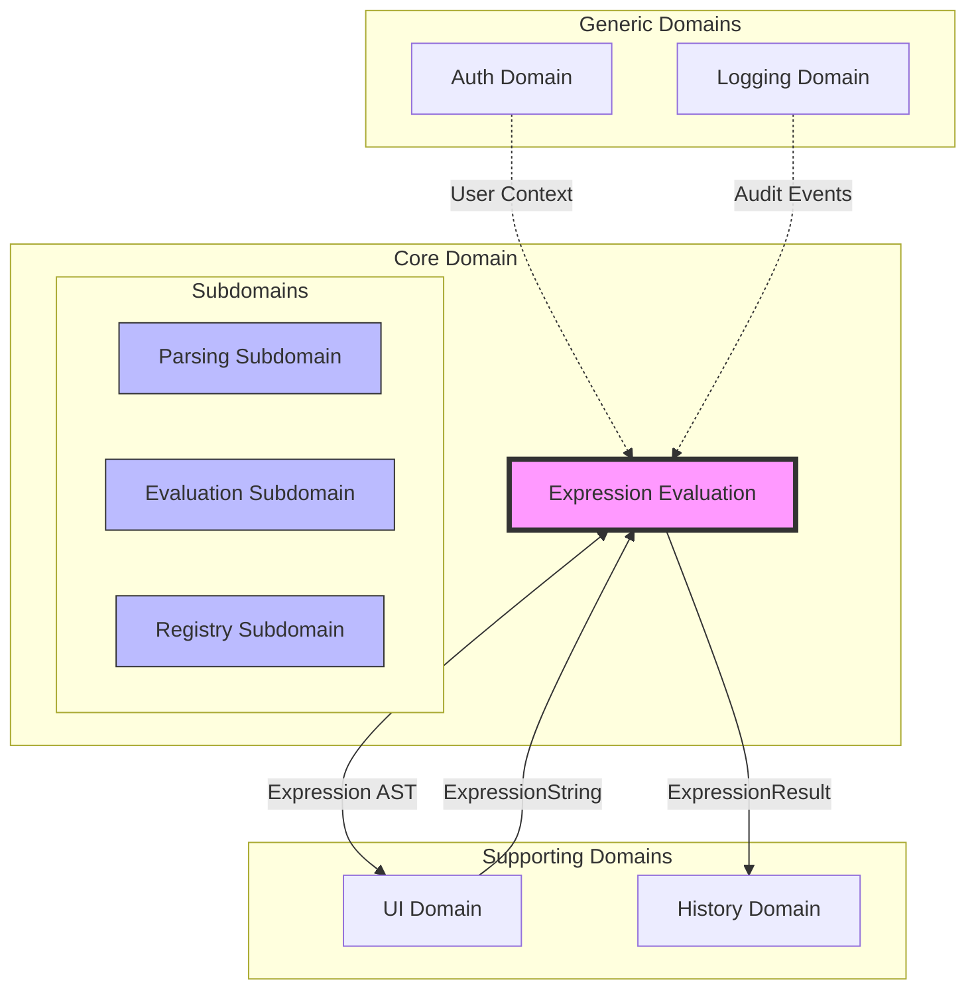
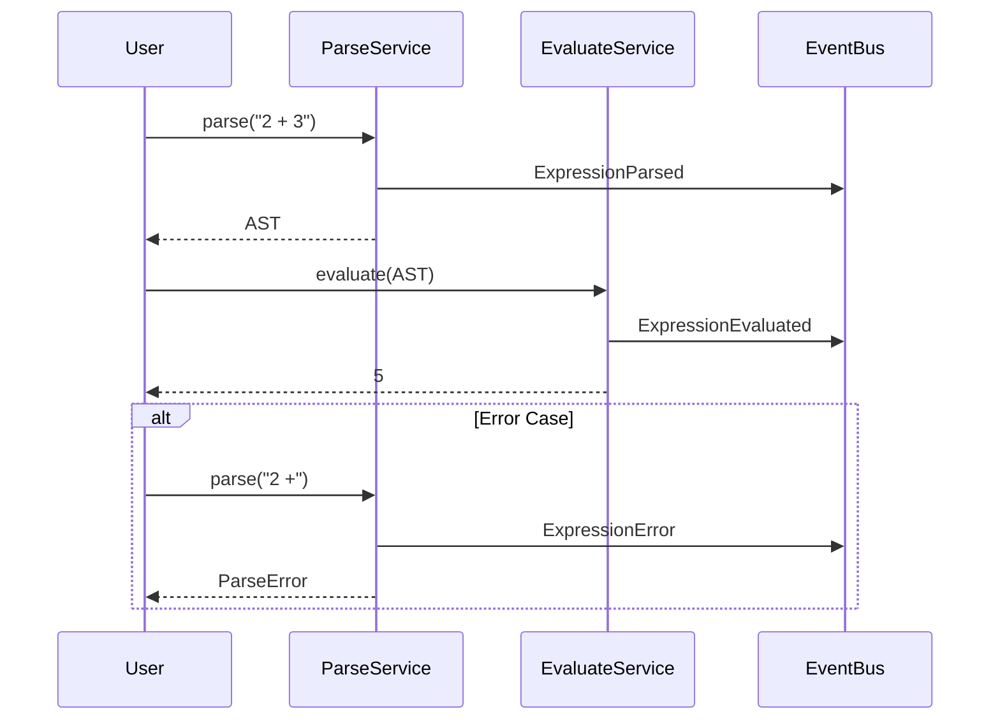

# Core Domain: Expression Evaluation

> **Domain**: Mathematical expression evaluation
> **Pattern**: DDD Bounded Context
> **Status**: Architecture Specification
> **Last Updated**: 2026-02-14

---

## 1. Context Overview

The Expression Evaluation domain is the **Core Domain** of Calculathor. It encapsulates all knowledge and operations related to parsing, analyzing, and evaluating mathematical expressions. This context follows the **Functional Core** principle, maintaining pure functions for all evaluation logic with side effects isolated to the infrastructure layer.

### Strategic Classification

| Attribute | Value |
|-----------|-------|
| **Domain Type** | Core Domain |
| **Business Differentiation** | High |
| **Complexity** | High |
| **Strategic Priority** | Critical |
| **Volatility** | Medium |

---

## 2. Context Map



### Integration Patterns

| Relationship | Pattern | Description |
|--------------|---------|-------------|
| UI Domain | Customer/Supplier | UI sends expression strings, receives results |
| History Domain | Published Language | Events published on evaluation |
| Auth Domain | Conformist | Uses auth context for user-scoped functions |
| Logging Domain | Separate Ways | Async audit event consumption |

---

## 3. Ubiquitous Language

### Core Terms

| Term | Definition | Category |
|------|------------|----------|
| **Expression** | A syntactically valid mathematical formula that can be parsed and evaluated | Entity |
| **Token** | The smallest meaningful unit of an expression (number, operator, identifier) | Value Object |
| **AST** (Abstract Syntax Tree) | Hierarchical representation of expression structure | Value Object |
| **Operator** | Symbol representing a mathematical operation (+, -, *, /, ^) | Value Object |
| **Precedence** | Priority level determining evaluation order | Attribute |
| **Binding Power** | Numeric value representing operator precedence in Pratt parsing | Attribute |
| **Null Denotation (nud)** | Behavior of a token at expression start | Concept |
| **Left Denotation (led)** | Behavior of a token to the left of an expression | Concept |
| **Function** | Named operation accepting arguments and returning a value | Entity |
| **Constant** | Named immutable numeric value (pi, e) | Value Object |
| **Arity** | Number of arguments a function accepts | Attribute |
| **Associativity** | Left or right grouping for operators of equal precedence | Attribute |

### Language in Context

```
A user inputs an "expression" string like "2 + 3 * 4".
The "tokenizer" breaks this into "tokens": [2, +, 3, *, 4].
The "parser" uses "binding powers" to build an "AST":
  +
 / \
2   *
   / \
  3   4
The "evaluator" traverses the AST, respecting "precedence",
producing a "result": 14.
```

---

## 4. Domain Model

### 4.1 Entities

#### Expression

```typescript
interface Expression {
  id: ExpressionId;                    // Unique identifier
  source: string;                      // Original input string
  ast: ASTNode;                        // Parsed abstract syntax tree
  status: ExpressionStatus;            // Parsed | Validated | Evaluated | Error
  metadata: ExpressionMetadata;        // Created at, user context
}

type ExpressionStatus =
  | 'pending'
  | 'parsed'
  | 'validated'
  | 'evaluated'
  | 'error';

interface ExpressionMetadata {
  createdAt: Date;
  userId?: UserId;
  sourceLine?: number;
}
```

**Invariants:**
- An Expression must have a valid AST before evaluation
- Source string must be non-empty
- Status transitions follow: pending → parsed → validated → evaluated

#### Function

```typescript
interface Function {
  id: FunctionId;
  name: FunctionName;                  // e.g., "sin", "customFunc"
  arity: Arity;                        // Number of arguments or variadic
  implementation: FunctionImplementation;
  category: FunctionCategory;          // BuiltIn | UserDefined | Custom
  registry: RegistryId;                // Which registry owns this function
}

type Arity = { type: 'fixed'; count: number } | { type: 'variadic' };

type FunctionImplementation =
  | { type: 'native'; fn: (...args: number[]) => number }
  | { type: 'ast'; body: ASTNode; parameters: string[] };
```

**Invariants:**
- Function names must be unique within a registry
- User-defined functions must have valid AST bodies
- Arity must match implementation signature

#### Constant

```typescript
interface Constant {
  id: ConstantId;
  name: ConstantName;                  // e.g., "pi", "e"
  value: number;
  category: ConstantCategory;          // BuiltIn | UserDefined
  registry: RegistryId;
}
```

### 4.2 Value Objects

#### Token

```typescript
interface Token {
  type: TokenType;
  value: string;
  position: SourcePosition;
}

type TokenType =
  | 'NUMBER'
  | 'IDENTIFIER'
  | 'OPERATOR'
  | 'LPAREN'
  | 'RPAREN'
  | 'COMMA'
  | 'EOF';

interface SourcePosition {
  offset: number;
  line: number;
  column: number;
}
```

**Characteristics:**
- Immutable
- Identity-free (equality based on value)
- Created by Tokenizer

#### ASTNode

```typescript
type ASTNode =
  | LiteralNode
  | IdentifierNode
  | UnaryNode
  | BinaryNode
  | CallNode;

interface LiteralNode {
  type: 'literal';
  value: number;
  position: SourcePosition;
}

interface IdentifierNode {
  type: 'identifier';
  name: string;
  position: SourcePosition;
}

interface UnaryNode {
  type: 'unary';
  operator: string;
  operand: ASTNode;
  position: SourcePosition;
}

interface BinaryNode {
  type: 'binary';
  operator: string;
  left: ASTNode;
  right: ASTNode;
  position: SourcePosition;
}

interface CallNode {
  type: 'call';
  callee: string;
  arguments: ASTNode[];
  position: SourcePosition;
}
```

**Characteristics:**
- Immutable tree structure
- Parent nodes reference child nodes
- Position information for error reporting

#### OperatorDef

```typescript
interface OperatorDef {
  symbol: string;
  precedence: number;                  // 0-100 scale
  associativity: Associativity;
  arity: OperatorArity;
  position: OperatorPosition;
}

type Associativity = 'left' | 'right';
type OperatorArity = 1 | 2;
type OperatorPosition = 'prefix' | 'infix' | 'postfix';
```

**Characteristics:**
- Defines operator behavior for Pratt parser
- Precedence determines binding power
- Used during parsing, not evaluation

---

## 5. Domain Services

### 5.1 ParseService

Responsible for converting expression strings into AST representations.

```typescript
interface ParseService {
  /**
   * Parse an expression string into an AST
   * @throws ParseError on syntax errors
   */
  parse(input: string, context: ParseContext): ParseResult;

  /**
   * Validate expression without full parsing
   */
  validate(input: string, context: ParseContext): ValidationResult;

  /**
   * Parse with user-defined functions in scope
   */
  parseWithFunctions(
    input: string,
    functions: Map<FunctionName, Function>,
    context: ParseContext
  ): ParseResult;
}

interface ParseResult {
  ast: ASTNode;
  tokens: Token[];
  diagnostics: Diagnostic[];
}

interface ParseContext {
  registry: OperatorRegistry;
  allowUserFunctions: boolean;
  maxExpressionLength: number;
}
```

**Algorithm:** Pratt Parser (Top-Down Operator Precedence)

### 5.2 EvaluateService

Responsible for evaluating AST nodes to produce numeric results.

```typescript
interface EvaluateService {
  /**
   * Evaluate an AST to produce a numeric result
   */
  evaluate(ast: ASTNode, context: EvaluateContext): number;

  /**
   * Evaluate with variable substitution
   */
  evaluateWithVariables(
    ast: ASTNode,
    variables: Map<string, number>,
    context: EvaluateContext
  ): number;

  /**
   * Partial evaluation - simplify where possible
   */
  simplify(ast: ASTNode, context: EvaluateContext): ASTNode;
}

interface EvaluateContext {
  registry: FunctionRegistry;
  constants: Map<string, number>;
  precision: number;
  timeoutMs: number;
}
```

**Algorithm:** Tree traversal with visitor pattern

### 5.3 RegistryService

Manages operator, function, and constant registries.

```typescript
interface RegistryService {
  // Operator management
  registerOperator(def: OperatorDef): void;
  getOperator(symbol: string): OperatorDef | undefined;
  listOperators(): OperatorDef[];

  // Function management
  registerFunction(fn: Function): void;
  getFunction(name: FunctionName): Function | undefined;
  unregisterFunction(name: FunctionName): void;

  // Constant management
  registerConstant(constant: Constant): void;
  getConstant(name: ConstantName): number | undefined;
}
```

---

## 6. Domain Events

```typescript
// Base event type
interface DomainEvent {
  id: EventId;
  occurredAt: Date;
  type: string;
}

// Expression events
interface ExpressionParsed extends DomainEvent {
  type: 'ExpressionParsed';
  expressionId: ExpressionId;
  source: string;
  tokenCount: number;
}

interface ExpressionEvaluated extends DomainEvent {
  type: 'ExpressionEvaluated';
  expressionId: ExpressionId;
  result: number;
  durationMs: number;
}

interface ExpressionError extends DomainEvent {
  type: 'ExpressionError';
  expressionId: ExpressionId;
  errorType: 'parse' | 'evaluation' | 'timeout';
  message: string;
  position?: SourcePosition;
}

// Function events
interface FunctionRegistered extends DomainEvent {
  type: 'FunctionRegistered';
  functionId: FunctionId;
  name: FunctionName;
  arity: Arity;
  category: FunctionCategory;
}

interface UserFunctionDefined extends DomainEvent {
  type: 'UserFunctionDefined';
  functionId: FunctionId;
  name: FunctionName;
  parameters: string[];
  body: ASTNode;
}

// Constant events
interface ConstantRegistered extends DomainEvent {
  type: 'ConstantRegistered';
  constantId: ConstantId;
  name: ConstantName;
  value: number;
}
```

### Event Flow



---

## 7. Repository Interfaces

### 7.1 ExpressionRepository

```typescript
interface ExpressionRepository {
  findById(id: ExpressionId): Promise<Expression | null>;
  findBySource(source: string): Promise<Expression[]>;
  findRecent(limit: number): Promise<Expression[]>;
  save(expression: Expression): Promise<void>;
  delete(id: ExpressionId): Promise<void>;
}
```

### 7.2 FunctionRepository

```typescript
interface FunctionRepository {
  findById(id: FunctionId): Promise<Function | null>;
  findByName(name: FunctionName): Promise<Function | null>;
  findByCategory(category: FunctionCategory): Promise<Function[]>;
  findByRegistry(registryId: RegistryId): Promise<Function[]>;
  save(fn: Function): Promise<void>;
  delete(id: FunctionId): Promise<void>;
  exists(name: FunctionName): Promise<boolean>;
}
```

### 7.3 ConstantRepository

```typescript
interface ConstantRepository {
  findById(id: ConstantId): Promise<Constant | null>;
  findByName(name: ConstantName): Promise<Constant | null>;
  findByRegistry(registryId: RegistryId): Promise<Constant[]>;
  save(constant: Constant): Promise<void>;
  delete(id: ConstantId): Promise<void>;
}
```

---

## 8. Factory Methods

### 8.1 Expression Factory

```typescript
class ExpressionFactory {
  static create(source: string, metadata?: Partial<ExpressionMetadata>): Expression {
    const id = generateExpressionId();
    return {
      id,
      source,
      ast: null as unknown as ASTNode, // Will be set after parsing
      status: 'pending',
      metadata: {
        createdAt: new Date(),
        ...metadata
      }
    };
  }

  static createFromAST(source: string, ast: ASTNode, metadata?: Partial<ExpressionMetadata>): Expression {
    return {
      id: generateExpressionId(),
      source,
      ast,
      status: 'parsed',
      metadata: {
        createdAt: new Date(),
        ...metadata
      }
    };
  }
}
```

### 8.2 Function Factory

```typescript
class FunctionFactory {
  static createNative(
    name: FunctionName,
    arity: Arity,
    fn: (...args: number[]) => number,
    registry: RegistryId = 'built-in'
  ): Function {
    return {
      id: generateFunctionId(),
      name,
      arity,
      implementation: { type: 'native', fn },
      category: registry === 'built-in' ? 'built-in' : 'custom',
      registry
    };
  }

  static createUserDefined(
    name: FunctionName,
    parameters: string[],
    body: ASTNode,
    registry: RegistryId
  ): Function {
    return {
      id: generateFunctionId(),
      name,
      arity: { type: 'fixed', count: parameters.length },
      implementation: { type: 'ast', body, parameters },
      category: 'user-defined',
      registry
    };
  }
}
```

### 8.3 Operator Factory

```typescript
class OperatorFactory {
  static create(
    symbol: string,
    precedence: number,
    associativity: Associativity,
    arity: OperatorArity,
    position: OperatorPosition = arity === 1 ? 'prefix' : 'infix'
  ): OperatorDef {
    return {
      symbol,
      precedence,
      associativity,
      arity,
      position
    };
  }

  static standardOperators(): OperatorDef[] {
    return [
      // Comparison (lowest precedence)
      this.create('==', 20, 'left', 2),
      this.create('!=', 20, 'left', 2),
      this.create('<', 20, 'left', 2),
      this.create('>', 20, 'left', 2),
      this.create('<=', 20, 'left', 2),
      this.create('>=', 20, 'left', 2),

      // Addition/Subtraction
      this.create('+', 30, 'left', 2),
      this.create('-', 30, 'left', 2),

      // Multiplication/Division/Modulo
      this.create('*', 40, 'left', 2),
      this.create('/', 40, 'left', 2),
      this.create('%', 40, 'left', 2),

      // Exponentiation (right-associative)
      this.create('^', 50, 'right', 2),

      // Unary operators (highest precedence)
      this.create('u+', 60, 'right', 1, 'prefix'),
      this.create('u-', 60, 'right', 1, 'prefix'),
    ];
  }
}
```

### 8.4 Constant Factory

```typescript
class ConstantFactory {
  static create(
    name: ConstantName,
    value: number,
    category: ConstantCategory = 'user-defined',
    registry: RegistryId = 'default'
  ): Constant {
    return {
      id: generateConstantId(),
      name,
      value,
      category,
      registry
    };
  }

  static standardConstants(): Constant[] {
    return [
      this.create('pi', Math.PI, 'built-in', 'built-in'),
      this.create('e', Math.E, 'built-in', 'built-in'),
      this.create('phi', 1.618033988749895, 'built-in', 'built-in'),
    ];
  }
}
```

---

## 9. Functional Core Design

The Expression Evaluation domain follows the **Functional Core, Imperative Shell** pattern:

### Core (Pure Functions)

```typescript
// /src/core/pure.ts

// Tokenization - pure function
export function tokenize(input: string): Token[];

// Parsing - pure function
export function parse(tokens: Token[], registry: OperatorRegistry): ASTNode;

// Evaluation - pure function
export function evaluate(
  ast: ASTNode,
  functions: Map<string, Function>,
  constants: Map<string, number>,
  variables: Map<string, number>
): number;

// AST transformation - pure function
export function simplify(ast: ASTNode): ASTNode;
```

### Shell (Side Effects)

```typescript
// /src/core/shell.ts

export class ExpressionService {
  constructor(
    private functionRepo: FunctionRepository,
    private constantRepo: ConstantRepository,
    private eventBus: EventBus
  ) {}

  async evaluateExpression(input: string): Promise<number> {
    // Shell: I/O operations
    const functions = await this.functionRepo.findAll();
    const constants = await this.constantRepo.findAll();

    // Core: Pure computation
    const tokens = tokenize(input);
    const ast = parse(tokens, defaultRegistry);
    const result = evaluate(ast, functions, constants, new Map());

    // Shell: Side effects
    await this.eventBus.publish({
      type: 'ExpressionEvaluated',
      result,
      occurredAt: new Date()
    });

    return result;
  }
}
```

### Benefits

1. **Testability**: Core functions are trivially testable
2. **Reproducibility**: Same input always produces same output
3. **Concurrency**: No shared mutable state
4. **Debugging**: Easy to trace and inspect

---

## 10. Module Structure

```
/src/core/
  /domain/
    expression.ts        # Expression entity
    function.ts          # Function entity
    constant.ts          # Constant entity
    token.ts             # Token value objects
    ast.ts               # AST node types
    operator.ts          # Operator definitions
    events.ts            # Domain events

  /services/
    parse-service.ts     # ParseService implementation
    evaluate-service.ts  # EvaluateService implementation
    registry-service.ts  # RegistryService implementation

  /factories/
    expression-factory.ts
    function-factory.ts
    operator-factory.ts
    constant-factory.ts

  /repositories/
    expression-repository.ts  # Interface only
    function-repository.ts    # Interface only
    constant-repository.ts    # Interface only

  /pure/
    tokenizer.ts         # Pure tokenization
    pratt-parser.ts      # Pure parsing
    evaluator.ts         # Pure evaluation
    simplifier.ts        # Pure AST simplification

  /shell/
    expression-service.ts # Orchestration with side effects
```

---

## 11. Invariants and Business Rules

### Expression Invariants

1. **Syntax Validity**: An expression must be syntactically valid before evaluation
2. **Type Safety**: All operands must be compatible with their operators
3. **Defined Identifiers**: All identifiers must resolve to defined functions or constants
4. **Arity Matching**: Function calls must provide correct number of arguments
5. **No Division by Zero**: Division operations must not have zero divisor

### Registry Invariants

1. **Unique Names**: Function and constant names must be unique within a registry
2. **Valid AST**: User-defined functions must contain valid AST bodies
3. **No Cycles**: User-defined functions must not create recursive cycles
4. **Reserved Names**: Built-in names cannot be overridden

### Evaluation Invariants

1. **Deterministic**: Same expression with same inputs always produces same result
2. **Finite**: Evaluation must complete within timeout period
3. **Numeric Output**: All expressions evaluate to numbers (or error)
4. **Precision**: Results maintain specified decimal precision

---

## 12. Anti-Corruption Layer

The Core Domain exposes a clean API to other bounded contexts:

```typescript
// Public API - /src/core/api.ts

export interface ExpressionApi {
  evaluate(input: string): Promise<number>;
  parse(input: string): Promise<ASTNode>;
  registerFunction(name: string, fn: (...args: number[]) => number): void;
  registerConstant(name: string, value: number): void;
}

// Implementation wraps domain services
export class ExpressionApiImpl implements ExpressionApi {
  // ... orchestrates domain services
}
```

---

## 13. Decision Log

| Decision | Context | Rationale |
|----------|---------|-----------|
| Pratt Parser | Parsing algorithm | Best balance of performance and extensibility |
| Functional Core | Architecture | Testability and maintainability |
| Immutable AST | Data structure | Thread safety and predictability |
| Event Sourcing | State changes | Audit trail and reactive updates |
| Registry Pattern | Extensibility | Runtime function/operator registration |

---

**Document Version**: 1.0
**Author**: Architecture Agent
**Status**: Ready for Implementation
