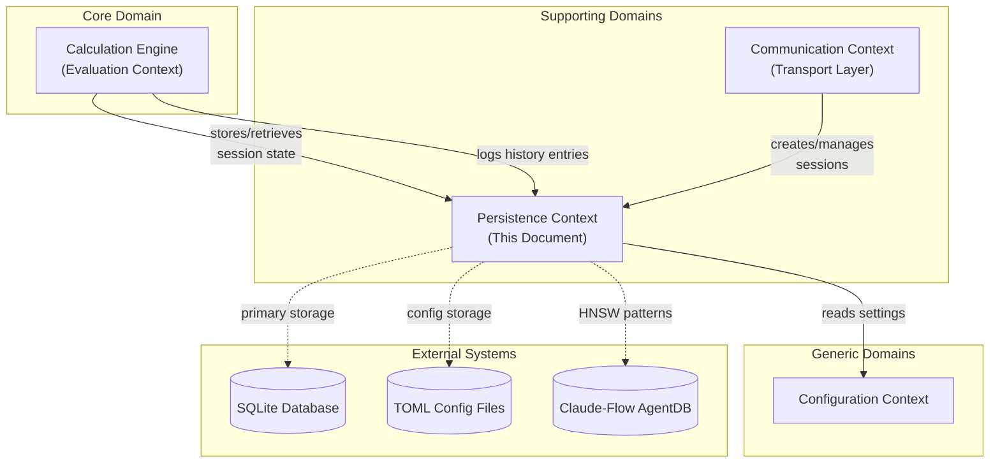

# DDD Bounded Context: Persistence (State Management)

> **Context Type**: Supporting Domain
> **Owner**: Memory Specialist / Persistence Architect
> **Status**: Design Phase
> **Tags**: ddd, persistence, session, sqlite, claude-flow

---

## 1. Context Overview

The Persistence bounded context manages all state management concerns for Calculathor, including session state, calculation history, user-defined functions, and configuration. This context provides the durability layer that enables the stateful session model described in ADR-004.

### 1.1 Core Responsibility

Maintain durable state across client sessions while providing fast in-memory access for active sessions. Bridge the gap between ephemeral session state and long-term persistence.

### 1.2 Bounded Context Relationship Map



### 1.3 Integration Patterns

| Consumer Context | Integration Type | Interface |
|------------------|------------------|-----------|
| Calculation Engine | Synchronous API | `IPersistenceService` |
| Communication (Session Manager) | Event-driven | `SessionCreated`, `SessionDestroyed` |
| TUI Client | Query API | `IHistoryQuery` |
| Claude-Flow Memory | Async pattern storage | `claude-flow memory store` |

---

## 2. Ubiquitous Language

### 2.1 Domain Terms

| Term | Definition | Synonyms (Avoid) |
|------|------------|------------------|
| **Session** | A client's isolated state container including variables, functions, and history | connection, context |
| **History Entry** | A recorded calculation with expression, result, timestamp, and metadata | log, record |
| **Variable** | A named value stored within a session scope | constant, parameter |
| **Function Definition** | A user-defined callable computation with parameters and body | macro, procedure |
| **Persistence** | The act of saving state to durable storage | save, commit |
| **Snapshot** | A point-in-time capture of session state | checkpoint, backup |
| **Settings** | Configuration values affecting persistence behavior | preferences, options |
| **Auto-Save** | Automatic persistence of session state at intervals | autosync, backup |

### 2.2 Event Storming Events

```
SessionCreated
SessionDestroyed
SessionSuspended
SessionResumed
VariableStored
VariableRetrieved
HistoryEntryRecorded
FunctionDefined
FunctionDeleted
SnapshotTaken
SettingsChanged
PersistenceError
```

---

## 3. Domain Model

### 3.1 Entity: Session

```typescript
interface Session {
  id: SessionId;                    // Unique identifier (e.g., "s_abc123")
  clientId: ClientId;               // Associated client connection
  status: SessionStatus;            // Active | Suspended | Terminated
  createdAt: Timestamp;
  lastActivityAt: Timestamp;
  expiresAt: Timestamp | null;

  // Relationships
  variables: Variable[];
  functions: UserFunction[];
  historyEntries: HistoryEntry[];

  // Methods
  activate(): void;
  suspend(): void;
  terminate(): void;
  touch(): void;                    // Update last activity
  isExpired(): boolean;
}

type SessionStatus = 'connected' | 'active' | 'suspended' | 'terminated';
type SessionId = branded<string, 'SessionId'>;
type ClientId = branded<string, 'ClientId'>;
```

**Invariants:**
- A session must have a unique ID
- A session expires after 30 minutes of inactivity (configurable)
- Suspended sessions have an extended expiration (24 hours)
- Terminated sessions are eligible for cleanup

### 3.2 Entity: HistoryEntry

```typescript
interface HistoryEntry {
  id: HistoryEntryId;
  sessionId: SessionId;
  expression: string;               // Original expression input
  result: ResultValue;              // Computed result
  resultType: 'number' | 'string' | 'error' | 'void';
  timestamp: Timestamp;
  executionTimeMs: number;          // Performance metric
  metadata: HistoryMetadata;

  // For semantic search (future HNSW)
  embedding?: number[];             // Vector embedding of expression
}

interface HistoryMetadata {
  clientType: 'tui' | 'cli' | 'gui' | 'web';
  evaluationMode: 'direct' | 'batch';
  tags?: string[];
}

type HistoryEntryId = branded<string, 'HistoryEntryId'>;
type ResultValue = number | string | null;
```

**Invariants:**
- Every entry must have a valid session association
- Execution time must be non-negative
- Result type must match the actual result value

### 3.3 Entity: UserFunction

```typescript
interface UserFunction {
  id: FunctionId;
  name: string;                     // Function identifier
  parameters: Parameter[];          // Parameter definitions
  body: string;                     // Expression body
  scope: FunctionScope;             // 'session' | 'global'
  sessionId?: SessionId;            // Null if global scope
  createdAt: Timestamp;
  updatedAt: Timestamp;
  version: number;                  // For optimistic locking

  // Computed property
  signature: string;                // "name(param1, param2)"
}

interface Parameter {
  name: string;
  defaultValue?: ResultValue;
}

type FunctionScope = 'session' | 'global';
type FunctionId = branded<string, 'FunctionId'>;
```

**Invariants:**
- Function names must be unique within scope
- Global functions are visible to all sessions
- Session-scoped functions are deleted with their session
- Version increments on each update

### 3.4 Value Object: Settings

```typescript
interface Settings {
  persistence: PersistenceSettings;
  history: HistorySettings;
  autoSave: AutoSaveSettings;
}

interface PersistenceSettings {
  enabled: boolean;
  storagePath: string;              // SQLite database location
  maxSessions: number;              // Per-engine limit
  sessionTimeoutMinutes: number;    // 30 minutes default
  suspendedTimeoutHours: number;    // 24 hours default
}

interface HistorySettings {
  maxEntriesPerSession: number;     // 1000 default
  retentionDays: number;            // 90 days default
  enableSemanticSearch: boolean;    // Future HNSW feature
}

interface AutoSaveSettings {
  enabled: boolean;
  intervalSeconds: number;          // 30 seconds default
  onVariableChange: boolean;        // Save immediately on var change
}
```

**Characteristics:**
- Immutable once loaded
- Reloaded on SIGUSR1 signal
- Validated on load
- Serialized to TOML format

### 3.5 Value Object: Snapshot

```typescript
interface Snapshot {
  id: SnapshotId;
  sessionId: SessionId;
  createdAt: Timestamp;
  data: SnapshotData;
  checksum: string;                 // Data integrity verification
}

interface SnapshotData {
  variables: Record<string, ResultValue>;
  functions: UserFunction[];
  historyCursor: number;            // Position in history
}

type SnapshotId = branded<string, 'SnapshotId'>;
```

**Characteristics:**
- Immutable capture of state
- Checksum validates integrity
- Used for session restore
- Compressed storage format

---

## 4. Domain Services

### 4.1 PersistenceService

```typescript
interface IPersistenceService {
  // Session lifecycle
  createSession(clientId: ClientId): Promise<Session>;
  loadSession(sessionId: SessionId): Promise<Session | null>;
  saveSession(session: Session): Promise<void>;
  destroySession(sessionId: SessionId): Promise<void>;

  // Variable operations
  storeVariable(sessionId: SessionId, name: string, value: ResultValue): Promise<void>;
  retrieveVariable(sessionId: SessionId, name: string): Promise<ResultValue | null>;
  retrieveAllVariables(sessionId: SessionId): Promise<Record<string, ResultValue>>;
  clearVariables(sessionId: SessionId): Promise<void>;

  // Function operations
  storeFunction(func: UserFunction): Promise<void>;
  retrieveFunction(scope: FunctionScope, name: string, sessionId?: SessionId): Promise<UserFunction | null>;
  retrieveAllFunctions(sessionId: SessionId): Promise<UserFunction[]>;
  deleteFunction(functionId: FunctionId): Promise<void>;

  // Snapshot operations
  createSnapshot(sessionId: SessionId): Promise<Snapshot>;
  restoreSnapshot(snapshotId: SnapshotId): Promise<Session>;

  // Maintenance
  cleanupExpiredSessions(): Promise<number>;  // Returns count cleaned
  vacuum(): Promise<void>;                    // Optimize storage
}
```

**Business Rules:**
- Auto-save triggers every 30 seconds for active sessions
- Variable changes trigger immediate save if `onVariableChange` is enabled
- Session cleanup runs every 5 minutes
- Failed persistence operations emit `PersistenceError` events

### 4.2 HistoryService

```typescript
interface IHistoryService {
  // Recording
  record(entry: HistoryEntry): Promise<void>;
  recordBatch(entries: HistoryEntry[]): Promise<void>;

  // Querying
  query(criteria: HistoryQuery): Promise<HistoryEntry[]>;
  getRecent(sessionId: SessionId, limit: number): Promise<HistoryEntry[]>;
  searchByExpression(pattern: string): Promise<HistoryEntry[]>;  // LIKE query
  searchSemantic(query: string): Promise<HistoryEntry[]>;        // Future: HNSW

  // Maintenance
  trim(sessionId: SessionId, maxEntries: number): Promise<number>;
  purge(olderThan: Timestamp): Promise<number>;

  // Claude-Flow integration
  storePattern(entry: HistoryEntry, tags: string[]): Promise<void>;
}

interface HistoryQuery {
  sessionId?: SessionId;
  startTime?: Timestamp;
  endTime?: Timestamp;
  resultType?: ResultType;
  expressionPattern?: string;
  limit?: number;
  offset?: number;
  orderBy: 'timestamp' | 'executionTime';
  orderDirection: 'asc' | 'desc';
}
```

**Business Rules:**
- History entries are immutable after creation
- Each session has a maximum entry limit (enforced on insert)
- Global purge removes entries older than retention period
- Semantic search requires embedding generation (future feature)

### 4.3 SettingsService

```typescript
interface ISettingsService {
  load(): Promise<Settings>;
  reload(): Promise<Settings>;       // Force reload from disk
  validate(settings: Settings): ValidationResult;
  getDefault(): Settings;

  // Watch for changes
  onChange(handler: (settings: Settings) => void): Unsubscribe;
}

interface ValidationResult {
  valid: boolean;
  errors: ValidationError[];
}

interface ValidationError {
  path: string;
  message: string;
}
```

---

## 5. Repository Interfaces

### 5.1 Repository Pattern

```typescript
// Generic repository interface
interface IRepository<T, ID> {
  findById(id: ID): Promise<T | null>;
  findAll(criteria?: QueryCriteria<T>): Promise<T[]>;
  save(entity: T): Promise<void>;
  delete(id: ID): Promise<void>;
  exists(id: ID): Promise<boolean>;
}

interface QueryCriteria<T> {
  where?: Partial<T>;
  orderBy?: keyof T;
  orderDirection?: 'asc' | 'desc';
  limit?: number;
  offset?: number;
}
```

### 5.2 Session Repository

```typescript
interface ISessionRepository extends IRepository<Session, SessionId> {
  findByClientId(clientId: ClientId): Promise<Session | null>;
  findActive(): Promise<Session[]>;
  findExpired(): Promise<Session[]>;
  findSuspended(): Promise<Session[]>;
  updateLastActivity(sessionId: SessionId): Promise<void>;
}
```

### 5.3 History Repository

```typescript
interface IHistoryRepository extends IRepository<HistoryEntry, HistoryEntryId> {
  findBySession(sessionId: SessionId, options: QueryOptions): Promise<HistoryEntry[]>;
  findByExpression(pattern: string): Promise<HistoryEntry[]>;
  findWithEmbedding(query: number[], limit: number): Promise<HistoryEntry[]>;  // HNSW
  countBySession(sessionId: SessionId): Promise<number>;
  deleteOlderThan(timestamp: Timestamp): Promise<number>;
}

interface QueryOptions {
  limit: number;
  offset: number;
  orderDirection: 'asc' | 'desc';
}
```

### 5.4 Function Repository

```typescript
interface IFunctionRepository extends IRepository<UserFunction, FunctionId> {
  findByScope(scope: FunctionScope, sessionId?: SessionId): Promise<UserFunction[]>;
  findByName(name: string, scope: FunctionScope, sessionId?: SessionId): Promise<UserFunction | null>;
  findBySession(sessionId: SessionId): Promise<UserFunction[]>;
  deleteBySession(sessionId: SessionId): Promise<number>;
  incrementVersion(functionId: FunctionId): Promise<void>;
}
```

### 5.5 Settings Repository

```typescript
interface ISettingsRepository {
  load(): Promise<Settings>;
  save(settings: Settings): Promise<void>;
  watch(callback: () => void): Unsubscribe;
}
```

---

## 6. Event Sourcing Considerations

### 6.1 Domain Events

```typescript
interface DomainEvent {
  eventId: string;
  eventType: string;
  aggregateId: string;
  timestamp: Timestamp;
  version: number;
  payload: unknown;
}

// Session events
interface SessionCreatedEvent extends DomainEvent {
  eventType: 'SessionCreated';
  payload: { sessionId: SessionId; clientId: ClientId };
}

interface SessionDestroyedEvent extends DomainEvent {
  eventType: 'SessionDestroyed';
  payload: { sessionId: SessionId; reason: 'disconnect' | 'timeout' | 'manual' };
}

// Variable events
interface VariableStoredEvent extends DomainEvent {
  eventType: 'VariableStored';
  payload: { sessionId: SessionId; name: string; value: ResultValue };
}

interface VariableClearedEvent extends DomainEvent {
  eventType: 'VariableCleared';
  payload: { sessionId: SessionId; name?: string };  // undefined = all cleared
}

// History events
interface HistoryEntryRecordedEvent extends DomainEvent {
  eventType: 'HistoryEntryRecorded';
  payload: { entryId: HistoryEntryId; sessionId: SessionId; expression: string };
}

// Function events
interface FunctionDefinedEvent extends DomainEvent {
  eventType: 'FunctionDefined';
  payload: { functionId: FunctionId; name: string; scope: FunctionScope };
}

interface FunctionDeletedEvent extends DomainEvent {
  eventType: 'FunctionDeleted';
  payload: { functionId: FunctionId; name: string };
}
```

### 6.2 Event Store Design

```typescript
interface IEventStore {
  append(event: DomainEvent): Promise<void>;
  appendBatch(events: DomainEvent[]): Promise<void>;
  getEvents(aggregateId: string): Promise<DomainEvent[]>;
  getEventsByType(eventType: string): Promise<DomainEvent[]>;
  getAllEvents(since?: Timestamp): Promise<DomainEvent[]>;
}
```

**Rationale:**
- Events provide audit trail for compliance/debugging
- Enable event replay for debugging calculation sequences
- Support analytics (calculation patterns, popular functions)
- Foundation for future distributed persistence

### 6.3 Snapshot Strategy

```typescript
interface ISnapshotStore {
  // Create snapshot at specific event position
  create(aggregateId: string, eventPosition: number): Promise<Snapshot>;

  // Get latest snapshot for aggregate
  getLatest(aggregateId: string): Promise<Snapshot | null>;

  // Restore aggregate to snapshot + replay events
  restore(aggregateId: string, upToEvent?: number): Promise<Session>;

  // Cleanup old snapshots
  prune(keepCount: number): Promise<number>;
}
```

**Implementation Notes:**
- Snapshots taken every 100 events per aggregate
- Keeps last 5 snapshots per session
- Uses SQLite JSON column for flexible storage
- Compression applied to large snapshots

---

## 7. Data Storage Strategy

### 7.1 SQLite Schema

```sql
-- Sessions table
CREATE TABLE sessions (
    id TEXT PRIMARY KEY,
    client_id TEXT NOT NULL,
    status TEXT NOT NULL CHECK (status IN ('connected', 'active', 'suspended', 'terminated')),
    created_at INTEGER NOT NULL,  -- Unix timestamp (ms)
    last_activity_at INTEGER NOT NULL,
    expires_at INTEGER,
    data TEXT  -- JSON: { variables: {}, settings: {} }
);

CREATE INDEX idx_sessions_client ON sessions(client_id);
CREATE INDEX idx_sessions_status ON sessions(status);
CREATE INDEX idx_sessions_expires ON sessions(expires_at);

-- Variables table (normalized for query efficiency)
CREATE TABLE variables (
    session_id TEXT NOT NULL,
    name TEXT NOT NULL,
    value TEXT NOT NULL,  -- JSON serialized
    updated_at INTEGER NOT NULL,
    PRIMARY KEY (session_id, name),
    FOREIGN KEY (session_id) REFERENCES sessions(id) ON DELETE CASCADE
);

CREATE INDEX idx_variables_session ON variables(session_id);

-- History entries table
CREATE TABLE history_entries (
    id TEXT PRIMARY KEY,
    session_id TEXT NOT NULL,
    expression TEXT NOT NULL,
    result TEXT,  -- JSON serialized
    result_type TEXT NOT NULL CHECK (result_type IN ('number', 'string', 'error', 'void')),
    timestamp INTEGER NOT NULL,
    execution_time_ms INTEGER NOT NULL,
    metadata TEXT,  -- JSON: { clientType, evaluationMode, tags }
    embedding BLOB,  -- Future: HNSW vector (Float32Array)
    FOREIGN KEY (session_id) REFERENCES sessions(id) ON DELETE CASCADE
);

CREATE INDEX idx_history_session ON history_entries(session_id);
CREATE INDEX idx_history_timestamp ON history_entries(timestamp);
CREATE INDEX idx_history_result_type ON history_entries(result_type);

-- User functions table
CREATE TABLE user_functions (
    id TEXT PRIMARY KEY,
    name TEXT NOT NULL,
    parameters TEXT NOT NULL,  -- JSON array
    body TEXT NOT NULL,
    scope TEXT NOT NULL CHECK (scope IN ('session', 'global')),
    session_id TEXT,  -- NULL for global functions
    created_at INTEGER NOT NULL,
    updated_at INTEGER NOT NULL,
    version INTEGER NOT NULL DEFAULT 1,
    FOREIGN KEY (session_id) REFERENCES sessions(id) ON DELETE CASCADE
);

CREATE INDEX idx_functions_scope ON user_functions(scope, session_id);
CREATE INDEX idx_functions_name ON user_functions(name);

-- Events table (for event sourcing)
CREATE TABLE events (
    id INTEGER PRIMARY KEY AUTOINCREMENT,
    event_id TEXT UNIQUE NOT NULL,
    event_type TEXT NOT NULL,
    aggregate_id TEXT NOT NULL,
    timestamp INTEGER NOT NULL,
    version INTEGER NOT NULL,
    payload TEXT NOT NULL  -- JSON
);

CREATE INDEX idx_events_aggregate ON events(aggregate_id);
CREATE INDEX idx_events_type ON events(event_type);
CREATE INDEX idx_events_timestamp ON events(timestamp);

-- Snapshots table
CREATE TABLE snapshots (
    id TEXT PRIMARY KEY,
    session_id TEXT NOT NULL,
    event_position INTEGER NOT NULL,
    created_at INTEGER NOT NULL,
    data BLOB NOT NULL,  -- Compressed JSON
    checksum TEXT NOT NULL,
    FOREIGN KEY (session_id) REFERENCES sessions(id) ON DELETE CASCADE
);

CREATE INDEX idx_snapshots_session ON snapshots(session_id);
```

### 7.2 Repository Implementations

```typescript
// SQLite implementation abstracted through interface
class SQLiteSessionRepository implements ISessionRepository {
  constructor(private db: Database, private eventStore: IEventStore) {}

  async findById(id: SessionId): Promise<Session | null> {
    const row = await this.db.query(
      'SELECT * FROM sessions WHERE id = ?',
      [id]
    ).get();

    if (!row) return null;
    return this.hydrate(row);
  }

  async save(session: Session): Promise<void> {
    await this.db.transaction(async (trx) => {
      // Upsert session
      await trx.run(`
        INSERT INTO sessions (id, client_id, status, created_at, last_activity_at, expires_at, data)
        VALUES (?, ?, ?, ?, ?, ?, ?)
        ON CONFLICT(id) DO UPDATE SET
          status = excluded.status,
          last_activity_at = excluded.last_activity_at,
          expires_at = excluded.expires_at,
          data = excluded.data
      `, [
        session.id,
        session.clientId,
        session.status,
        session.createdAt,
        session.lastActivityAt,
        session.expiresAt,
        JSON.stringify({ /* session data */ })
      ]);

      // Persist domain event
      await this.eventStore.append({
        eventId: generateId(),
        eventType: 'SessionUpdated',
        aggregateId: session.id,
        timestamp: Date.now(),
        version: await this.getNextVersion(session.id),
        payload: { status: session.status }
      });
    });
  }

  private hydrate(row: any): Session {
    // Transform row to Session entity
    return {
      id: row.id as SessionId,
      clientId: row.client_id as ClientId,
      status: row.status,
      createdAt: row.created_at,
      lastActivityAt: row.last_activity_at,
      expiresAt: row.expires_at,
      // ... hydrate other properties
    };
  }

  private async getNextVersion(aggregateId: string): Promise<number> {
    const result = await this.db.query(
      'SELECT MAX(version) as max_version FROM events WHERE aggregate_id = ?',
      [aggregateId]
    ).get();
    return (result?.max_version ?? 0) + 1;
  }
}
```

---

## 8. Claude-Flow Memory Integration

### 8.1 Pattern Storage

```typescript
interface PersistencePattern {
  id: string;
  type: 'session_recovery' | 'variable_pattern' | 'calculation_pattern';
  data: unknown;
  metadata: {
    frequency: number;
    lastUsed: Timestamp;
    successRate: number;
  };
}

class PersistencePatternStore {
  constructor(private cli: ClaudeFlowCLI) {}

  async storePattern(pattern: PersistencePattern): Promise<void> {
    await this.cli.memoryStore({
      key: `persistence:${pattern.type}:${pattern.id}`,
      value: JSON.stringify(pattern),
      namespace: 'calculathor.persistence',
      tags: ['ddd', 'persistence', 'session', pattern.type]
    });
  }

  async findPatterns(type: string, limit: number = 10): Promise<PersistencePattern[]> {
    const results = await this.cli.memorySearch({
      query: `persistence pattern ${type}`,
      namespace: 'calculathor.persistence',
      limit,
      threshold: 0.7
    });

    return results.map(r => JSON.parse(r.value));
  }
}
```

### 8.2 CLI Integration

```bash
# Store session recovery pattern
npx @claude-flow/cli@latest memory store \
  --key "session:recovery:s123" \
  --value '{"strategy": "restore_snapshot", "snapshotId": "snap_456"}' \
  --namespace calculathor.persistence \
  --tags ddd,persistence,session,recovery

# Search for similar session patterns
npx @claude-flow/cli@latest memory search \
  --query "session recovery after disconnect" \
  --namespace calculathor.persistence \
  --limit 5 \
  --threshold 0.75

# Store calculation history pattern
npx @claude-flow/cli@latest memory store \
  --key "history:pattern:financial" \
  --value '{"expressions": ["roi = (gain/cost)", "npv = ..."], "category": "financial"}' \
  --namespace calculathor.persistence \
  --tags ddd,persistence,history,financial
```

### 8.3 HNSW Semantic Search (Future)

```typescript
interface HNSWHistorySearch {
  // Generate embedding for expression
  async generateEmbedding(expression: string): Promise<number[]> {
    // Integration with embedding service
    // Returns 1536-dimensional vector (OpenAI-compatible)
  }

  // Store with embedding for semantic search
  async recordWithEmbedding(entry: HistoryEntry): Promise<void> {
    const embedding = await this.generateEmbedding(entry.expression);

    await this.db.run(`
      INSERT INTO history_entries (id, session_id, expression, result, result_type,
                                   timestamp, execution_time_ms, metadata, embedding)
      VALUES (?, ?, ?, ?, ?, ?, ?, ?, ?)
    `, [
      entry.id,
      entry.sessionId,
      entry.expression,
      JSON.stringify(entry.result),
      entry.resultType,
      entry.timestamp,
      entry.executionTimeMs,
      JSON.stringify(entry.metadata),
      new Float32Array(embedding)  // Stored as BLOB
    ]);

    // Also index in Claude-Flow HNSW for cross-session search
    await this.claudeFlow.memoryStore({
      key: `history:${entry.id}`,
      value: entry.expression,
      namespace: 'calculathor.history',
      tags: ['ddd', 'persistence', 'history', 'hnsw']
    });
  }

  // Semantic search using HNSW
  async searchSemantic(query: string, limit: number = 10): Promise<HistoryEntry[]> {
    const queryEmbedding = await this.generateEmbedding(query);

    // SQLite HNSW extension query (future)
    // Or use Claude-Flow's built-in HNSW search
    const results = await this.claudeFlow.memorySearch({
      query,
      namespace: 'calculathor.history',
      limit,
      threshold: 0.8
    });

    return this.fetchEntriesByIds(results.map(r => r.key.replace('history:', '')));
  }
}
```

---

## 9. Migration Strategy

### 9.1 Schema Versioning

```typescript
interface Migration {
  version: number;
  name: string;
  up: string;   -- SQL to migrate up
  down: string; -- SQL to rollback
}

const MIGRATIONS: Migration[] = [
  {
    version: 1,
    name: 'initial_schema',
    up: `
      CREATE TABLE schema_version (version INTEGER PRIMARY KEY);
      INSERT INTO schema_version VALUES (1);
      -- Create initial tables...
    `,
    down: `DROP TABLE IF EXISTS schema_version;`
  },
  {
    version: 2,
    name: 'add_history_embedding',
    up: `
      ALTER TABLE history_entries ADD COLUMN embedding BLOB;
      CREATE INDEX idx_history_embedding ON history_entries(embedding);
    `,
    down: `
      DROP INDEX idx_history_embedding;
      -- SQLite doesn't support DROP COLUMN, would need table recreation
    `
  },
  {
    version: 3,
    name: 'add_events_table',
    up: `
      CREATE TABLE events (...);
      CREATE INDEX idx_events_aggregate ON events(aggregate_id);
    `,
    down: `DROP TABLE events;`
  }
];

class SchemaMigrator {
  async migrate(targetVersion?: number): Promise<void> {
    const currentVersion = await this.getCurrentVersion();
    targetVersion ??= MIGRATIONS.length;

    if (currentVersion < targetVersion) {
      for (const migration of MIGRATIONS) {
        if (migration.version > currentVersion && migration.version <= targetVersion) {
          await this.applyMigration(migration);
        }
      }
    }
  }

  private async applyMigration(migration: Migration): Promise<void> {
    await this.db.transaction(async (trx) => {
      await trx.exec(migration.up);
      await trx.run(
        'INSERT OR REPLACE INTO schema_version (version) VALUES (?)',
        [migration.version]
      );
    });
  }
}
```

### 9.2 Data Migration from Legacy

```typescript
class LegacyDataMigrator {
  constructor(
    private sourceDb: Database,  // Legacy SQLite
    private targetDb: Database,  // New schema
    private eventStore: IEventStore
  ) {}

  async migrate(): Promise<MigrationReport> {
    const report: MigrationReport = {
      sessions: 0,
      historyEntries: 0,
      functions: 0,
      errors: []
    };

    await this.targetDb.transaction(async (trx) => {
      // Migrate sessions
      const sessions = await this.sourceDb.query('SELECT * FROM old_sessions').all();
      for (const session of sessions) {
        try {
          await this.migrateSession(trx, session);
          report.sessions++;
        } catch (error) {
          report.errors.push({ entity: 'session', id: session.id, error });
        }
      }

      // Migrate history
      const history = await this.sourceDb.query('SELECT * FROM old_history').all();
      for (const entry of history) {
        try {
          await this.migrateHistoryEntry(trx, entry);
          report.historyEntries++;
        } catch (error) {
          report.errors.push({ entity: 'history', id: entry.id, error });
        }
      }

      // Migrate functions
      const functions = await this.sourceDb.query('SELECT * FROM old_functions').all();
      for (const func of functions) {
        try {
          await this.migrateFunction(trx, func);
          report.functions++;
        } catch (error) {
          report.errors.push({ entity: 'function', id: func.id, error });
        }
      }
    });

    return report;
  }

  private async migrateSession(trx: Transaction, old: any): Promise<void> {
    // Transform old schema to new
    const session: Session = {
      id: old.id as SessionId,
      clientId: old.client_id as ClientId,
      status: this.mapStatus(old.status),
      createdAt: old.created_at,
      lastActivityAt: old.last_accessed,
      expiresAt: null,
      // ...
    };

    await trx.run(`
      INSERT INTO sessions (id, client_id, status, created_at, last_activity_at, expires_at, data)
      VALUES (?, ?, ?, ?, ?, ?, ?)
    `, [session.id, session.clientId, session.status, session.createdAt,
        session.lastActivityAt, session.expiresAt, '{}']);
  }

  private mapStatus(oldStatus: string): SessionStatus {
    const mapping: Record<string, SessionStatus> = {
      'active': 'active',
      'inactive': 'suspended',
      'closed': 'terminated'
    };
    return mapping[oldStatus] ?? 'terminated';
  }
}
```

### 9.3 Rollback Strategy

```typescript
interface RollbackPlan {
  backupPath: string;
  targetVersion: number;
  steps: RollbackStep[];
}

interface RollbackStep {
  order: number;
  table: string;
  action: 'restore' | 'delete' | 'transform';
  details: string;
}

class MigrationRollback {
  async createBackup(dbPath: string): Promise<string> {
    const backupPath = `${dbPath}.backup.${Date.now()}`;
    await Bun.spawn(['cp', dbPath, backupPath]).exited;
    return backupPath;
  }

  async rollback(backupPath: string): Promise<void> {
    // Stop all services
    // Restore from backup
    // Resume services
  }
}
```

---

## 10. Testing Strategy

### 10.1 Unit Tests

```typescript
describe('PersistenceService', () => {
  let service: IPersistenceService;
  let mockRepo: MockSessionRepository;

  beforeEach(() => {
    mockRepo = new MockSessionRepository();
    service = new PersistenceService(mockRepo, new MockEventStore());
  });

  describe('createSession', () => {
    it('should create a session with unique ID', async () => {
      const session = await service.createSession('client-1' as ClientId);
      expect(session.id).toBeDefined();
      expect(session.status).toBe('active');
    });

    it('should emit SessionCreated event', async () => {
      const events: DomainEvent[] = [];
      service.onEvent(e => events.push(e));

      await service.createSession('client-1' as ClientId);

      expect(events).toHaveLength(1);
      expect(events[0].eventType).toBe('SessionCreated');
    });
  });

  describe('session expiration', () => {
    it('should mark expired sessions for cleanup', async () => {
      const oldSession = await createOldSession(31 * 60 * 1000); // 31 minutes ago
      await mockRepo.save(oldSession);

      const cleaned = await service.cleanupExpiredSessions();

      expect(cleaned).toBe(1);
      const session = await mockRepo.findById(oldSession.id);
      expect(session?.status).toBe('terminated');
    });
  });
});
```

### 10.2 Integration Tests

```typescript
describe('SQLite Integration', () => {
  let db: Database;
  let repository: ISessionRepository;

  beforeEach(async () => {
    db = new Database(':memory:');
    await runMigrations(db);
    repository = new SQLiteSessionRepository(db, new SQLiteEventStore(db));
  });

  afterEach(() => db.close());

  it('should persist and retrieve session with variables', async () => {
    const session: Session = {
      id: 's-123' as SessionId,
      clientId: 'client-1' as ClientId,
      status: 'active',
      createdAt: Date.now(),
      lastActivityAt: Date.now(),
      expiresAt: null,
      variables: [{ name: 'x', value: 42 }],
      functions: [],
      historyEntries: []
    };

    await repository.save(session);
    const retrieved = await repository.findById(session.id);

    expect(retrieved).toEqual(session);
  });

  it('should cascade delete session data', async () => {
    // Create session with history
    // Delete session
    // Verify history entries also deleted
  });
});
```

### 10.3 Performance Tests

```typescript
describe('Performance Benchmarks', () => {
  it('should handle 1000 concurrent session writes', async () => {
    const sessions = Array.from({ length: 1000 }, (_, i) =>
      createSession(`client-${i}`)
    );

    const start = performance.now();
    await Promise.all(sessions.map(s => repository.save(s)));
    const duration = performance.now() - start;

    expect(duration).toBeLessThan(5000); // 5 seconds max
  });

  it('should query history within 100ms for 10k entries', async () => {
    // Seed 10k history entries
    const start = performance.now();
    const results = await historyService.query({
      sessionId: 's-123' as SessionId,
      limit: 100
    });
    const duration = performance.now() - start;

    expect(duration).toBeLessThan(100);
    expect(results).toHaveLength(100);
  });
});
```

---

## 11. Implementation Roadmap

### Phase 1: Core Infrastructure (Week 1)
- [ ] Define repository interfaces
- [ ] Implement SQLite schema and migrations
- [ ] Create basic Session repository
- [ ] Add domain event infrastructure
- [ ] Implement Settings service

### Phase 2: Domain Services (Week 2)
- [ ] Implement PersistenceService
- [ ] Implement HistoryService
- [ ] Add session lifecycle management
- [ ] Implement auto-save mechanism
- [ ] Add session cleanup job

### Phase 3: Integration (Week 3)
- [ ] Integrate with Session Manager (Communication Context)
- [ ] Wire up to Calculation Engine
- [ ] Add Claude-Flow memory integration
- [ ] Implement snapshot/restore functionality
- [ ] Add comprehensive error handling

### Phase 4: Advanced Features (Week 4-5)
- [ ] Implement event sourcing (optional)
- [ ] Add HNSW semantic search for history
- [ ] Performance optimization
- [ ] Migration tooling
- [ ] Backup/restore functionality

---

## 12. ADR References

| ADR | Title | Relevance |
|-----|-------|-----------|
| ADR-001 | Daemon vs Spawn-Per-Client | Stateful session persistence |
| ADR-002 | Communication Transport | Session per connection |
| ADR-004 | State Management Model | Per-client session isolation |

---

## 13. Appendix: Type Definitions

```typescript
// Branded types for type safety
export type branded<T, B> = T & { __brand: B };

// Core domain types
export type Timestamp = number;
export type Unsubscribe = () => void;

// Re-export for convenience
export {
  Session,
  SessionId,
  SessionStatus,
  HistoryEntry,
  HistoryEntryId,
  UserFunction,
  FunctionId,
  FunctionScope,
  Settings,
  Snapshot,
  SnapshotId,
  ResultValue,
  ResultType,
  DomainEvent,
  IPersistenceService,
  IHistoryService,
  ISettingsService,
  ISessionRepository,
  IHistoryRepository,
  IFunctionRepository,
  ISettingsRepository,
  IEventStore
};
```

---

**Document Version**: 1.0
**Last Updated**: 2026-02-14
**Owner**: Memory Specialist
**Reviewers**: Core Architect, Integration Architect
