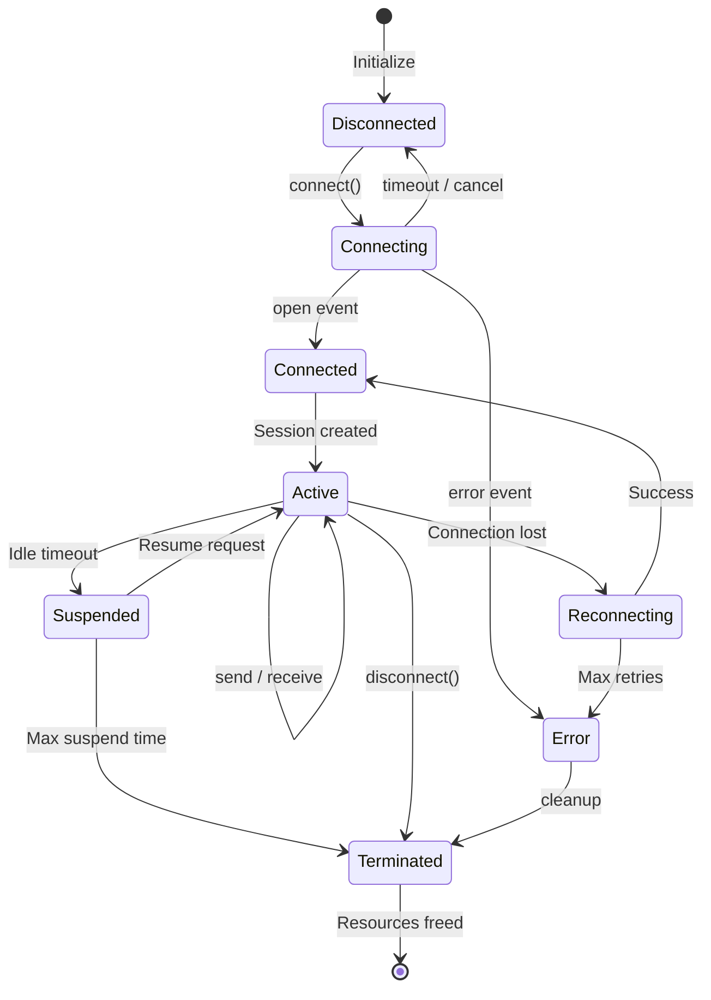

# Transport Bounded Context

> **Domain**: Inter-process communication and client-server protocol
> **Context Type**: Core Domain (Supports all client types)
> **Ubiquitous Language**: transport, socket, message, request, response, connection

---

## 1. Overview

The Transport Bounded Context manages all inter-process communication between Calculathor clients and the engine. It abstracts transport mechanisms (Unix sockets, TCP, stdio) and implements the JSON-RPC 2.0 protocol for request-response communication.

### Key Responsibilities

- Manage transport connections (Unix socket, TCP, stdio)
- Implement JSON-RPC 2.0 protocol handling
- Handle connection lifecycle (connect, reconnect, disconnect)
- Manage message framing and serialization
- Provide domain events for transport state changes
- Implement error handling and recovery strategies

---

## 2. Ubiquitous Language

| Term | Definition |
|------|------------|
| **Transport** | The communication channel between client and engine |
| **Socket** | An endpoint for sending/receiving data |
| **Message** | A unit of communication (JSON-RPC request/response) |
| **Request** | A JSON-RPC method invocation sent from client |
| **Response** | A JSON-RPC result or error returned from server |
| **Connection** | An established communication session between endpoints |
| **Protocol** | The rules governing message format and exchange |
| **TransportConfig** | Configuration for transport behavior |
| **SocketAddress** | Location of a socket (path or host:port) |
| **ConnectionState** | Current state of a connection (connecting, connected, disconnected) |
| **TransportStrategy** | Abstract interface for transport implementations |

---

## 3. Entities

### 3.1 Connection

Represents an active communication channel between client and server.

```typescript
interface Connection {
  id: ConnectionId;           // Unique identifier (UUID)
  state: ConnectionState;     // Current state
  transport: TransportType;   // unix | tcp | stdio
  socket: Bun.Socket;         // Underlying socket reference
  createdAt: DateTime;
  lastActivity: DateTime;
  sessionId?: SessionId;      // Associated session

  // Domain Methods
  connect(address: SocketAddress): Promise<Result<void, ConnectionError>>;
  disconnect(): Promise<void>;
  send(message: Message): Promise<Result<void, SendError>>;
  receive(data: Buffer): Result<Message[], ParseError>;
}

enum ConnectionState {
  DISCONNECTED = 'disconnected',
  CONNECTING = 'connecting',
  CONNECTED = 'connected',
  RECONNECTING = 'reconnecting',
  ERROR = 'error',
  CLOSED = 'closed'
}
```

**Invariants:**
- Connection ID is immutable after creation
- State transitions must follow valid state machine
- Only `CONNECTED` state can send/receive messages
- `lastActivity` updates on every send/receive

**Domain Events:**
- `ConnectionOpened` - New connection established
- `ConnectionClosed` - Connection terminated
- `ConnectionError` - Error occurred on connection
- `ConnectionStateChanged` - State transition occurred

---

### 3.2 Message

Base class for all JSON-RPC messages.

```typescript
abstract class Message {
  readonly jsonrpc: '2.0' = '2.0';
  readonly id?: RequestId;    // null/undefined for notifications

  abstract serialize(): string;
  abstract validate(): Result<void, ValidationError>;
}

class Request extends Message {
  readonly method: MethodName;
  readonly params?: unknown;

  constructor(method: string, params?: unknown, id?: RequestId) {
    super();
    this.method = method;
    this.params = params;
    this.id = id;
  }

  isNotification(): boolean {
    return this.id === undefined;
  }
}

class Response extends Message {
  readonly result?: unknown;
  readonly error?: RpcError;

  constructor(id: RequestId, result?: unknown, error?: RpcError) {
    super();
    this.id = id;
    this.result = result;
    this.error = error;
  }

  isError(): boolean {
    return this.error !== undefined;
  }
}

class BatchRequest extends Message {
  readonly requests: Request[];

  constructor(requests: Request[]) {
    super();
    this.requests = requests;
  }
}

class BatchResponse extends Message {
  readonly responses: Response[];

  constructor(responses: Response[]) {
    super();
    this.responses = responses;
  }
}
```

**Invariants:**
- `jsonrpc` must always be `"2.0"`
- Response must have same ID as corresponding Request
- Error response cannot have result, success cannot have error
- Batch must contain at least one item

---

### 3.3 Request

A JSON-RPC request message calling a specific method.

```typescript
interface Request {
  readonly jsonrpc: '2.0';
  readonly method: MethodName;    // e.g., 'eval', 'set_var', 'ping'
  readonly params?: RequestParams;
  readonly id?: RequestId;        // String, number, or null

  // Factory Methods
  static create(method: string, params?: unknown, id?: RequestId): Request;
  static notification(method: string, params?: unknown): Request;
  static batch(requests: Request[]): BatchRequest;
}

// Example requests
const evalRequest = Request.create('eval', { expr: '1 + 2' }, 1);
const clearNotification = Request.notification('clear_vars', {});
```

**Invariants:**
- Method name must be non-empty string
- Params must be object or array (if present)
- ID must be string, number, or null (undefined for notifications)

---

### 3.4 Response

A JSON-RPC response containing result or error.

```typescript
interface Response {
  readonly jsonrpc: '2.0';
  readonly result?: unknown;
  readonly error?: RpcError;
  readonly id: RequestId | null;

  // Factory Methods
  static success(id: RequestId, result: unknown): Response;
  static error(id: RequestId | null, error: RpcError): Response;
}

interface RpcError {
  readonly code: ErrorCode;
  readonly message: string;
  readonly data?: unknown;
}

// Standard JSON-RPC 2.0 Error Codes
enum ErrorCode {
  PARSE_ERROR = -32700,          // Invalid JSON
  INVALID_REQUEST = -32600,      // Not valid JSON-RPC
  METHOD_NOT_FOUND = -32601,     // Unknown method
  INVALID_PARAMS = -32602,       // Wrong parameters
  INTERNAL_ERROR = -32603,       // Server error

  // Application-specific codes (start at -32000)
  CALCULATION_ERROR = -32000,    // Math errors
  UNDEFINED_VARIABLE = -32001,   // Variable not found
  INVALID_EXPRESSION = -32002,   // Parse error
  TIMEOUT_ERROR = -32003,        // Request timeout
  TRANSPORT_ERROR = -32004       // Connection error
}
```

**Invariants:**
- Must have either result OR error (never both, never neither)
- Error code must be integer
- Error message must be non-empty string
- Response ID matches request ID (null for parse errors)

---

## 4. Value Objects

### 4.1 TransportConfig

Configuration for transport behavior.

```typescript
interface TransportConfig {
  // Transport selection
  transport: TransportType;       // 'unix' | 'tcp' | 'stdio'

  // Connection settings
  connectionTimeout: Milliseconds;   // Default: 5000ms
  requestTimeout: Milliseconds;      // Default: 30000ms
  keepAliveInterval: Milliseconds;   // Default: 30000ms

  // Reconnection settings
  maxRetries: number;                // Default: 3
  retryDelay: Milliseconds;          // Default: 1000ms (exponential backoff)
  maxRetryDelay: Milliseconds;       // Default: 30000ms

  // Socket-specific
  socketPath?: UnixSocketPath;       // For unix transport
  host?: Hostname;                   // For tcp transport (default: 127.0.0.1)
  port?: Port;                       // For tcp transport (default: 7437)

  // Behavior flags
  autoStartDaemon: boolean;          // Default: true
  autoReconnect: boolean;            // Default: true
  useCompression: boolean;           // Default: false

  // Validation
  validate(): Result<void, ConfigError>;
}

// Factory with sensible defaults
TransportConfig.create({
  transport: 'unix',
  socketPath: '/tmp/calculathor.sock'
});
```

**Characteristics:**
- Immutable - all properties readonly
- Self-validating on creation
- Platform-specific defaults (socket path varies by OS)

---

### 4.2 SocketAddress

Abstract address for socket connections.

```typescript
abstract class SocketAddress {
  abstract readonly type: TransportType;
  abstract toString(): string;
  abstract equals(other: SocketAddress): boolean;
}

class UnixSocketAddress extends SocketAddress {
  readonly type = 'unix';
  readonly path: string;

  constructor(path: string) {
    super();
    this.path = path;
  }

  toString(): string {
    return `unix://${this.path}`;
  }

  equals(other: SocketAddress): boolean {
    return other instanceof UnixSocketAddress &&
           other.path === this.path;
  }

  // Platform detection
  static getDefaultPath(): string {
    if (process.env.CALCULATHOR_SOCKET) {
      return process.env.CALCULATHOR_SOCKET;
    }
    if (process.env.XDG_RUNTIME_DIR) {
      return `${process.env.XDG_RUNTIME_DIR}/calculathor/socket`;
    }
    if (process.platform === 'darwin') {
      return `${process.env.HOME}/Library/Caches/calculathor/socket`;
    }
    return `/tmp/calculathor-${process.getuid?.() || 0}/socket`;
  }
}

class TcpSocketAddress extends SocketAddress {
  readonly type = 'tcp';
  readonly host: string;
  readonly port: number;

  constructor(host: string, port: number) {
    super();
    this.host = host;
    this.port = port;
  }

  toString(): string {
    return `tcp://${this.host}:${this.port}`;
  }

  equals(other: SocketAddress): boolean {
    return other instanceof TcpSocketAddress &&
           other.host === this.host &&
           other.port === this.port;
  }

  static default(): TcpSocketAddress {
    return new TcpSocketAddress('127.0.0.1', 7437);
  }
}

class StdioAddress extends SocketAddress {
  readonly type = 'stdio';

  toString(): string {
    return 'stdio://-';
  }

  equals(other: SocketAddress): boolean {
    return other instanceof StdioAddress;
  }
}
```

**Characteristics:**
- Immutable value objects
- Platform-aware defaults
- Type-safe discriminated union pattern

---

### 4.3 ProtocolVersion

Semantic versioning for protocol compatibility.

```typescript
class ProtocolVersion {
  readonly major: number;
  readonly minor: number;
  readonly patch: number;

  constructor(major: number, minor: number, patch: number = 0) {
    this.major = major;
    this.minor = minor;
    this.patch = patch;
  }

  toString(): string {
    return `${this.major}.${this.minor}.${this.patch}`;
  }

  // Check compatibility
  isCompatibleWith(other: ProtocolVersion): boolean {
    // Same major version = compatible
    return this.major === other.major;
  }

  compareTo(other: ProtocolVersion): number {
    if (this.major !== other.major) return this.major - other.major;
    if (this.minor !== other.minor) return this.minor - other.minor;
    return this.patch - other.patch;
  }

  // JSON-RPC 2.0 version
  static jsonrpc(): ProtocolVersion {
    return new ProtocolVersion(2, 0);
  }
}
```

---

## 5. Domain Services

### 5.1 TransportService

Orchestrates transport selection and message routing.

```typescript
interface TransportService {
  // Transport management
  initialize(config: TransportConfig): Promise<Result<void, InitError>>;
  shutdown(): Promise<void>;

  // Connection lifecycle
  connect(address: SocketAddress): Promise<Result<Connection, ConnectionError>>;
  disconnect(connectionId: ConnectionId): Promise<void>;

  // Message operations
  send(connectionId: ConnectionId, message: Message): Promise<Result<void, SendError>>;
  sendAndWait(connectionId: ConnectionId, request: Request): Promise<Result<Response, RpcError>>;

  // Query
  getConnection(connectionId: ConnectionId): Option<Connection>;
  getActiveConnections(): Connection[];

  // Events
  onConnectionOpened: Event<ConnectionOpenedEvent>;
  onConnectionClosed: Event<ConnectionClosedEvent>;
  onMessageReceived: Event<MessageReceivedEvent>;
  onTransportError: Event<TransportErrorEvent>;
}

class TransportServiceImpl implements TransportService {
  private connections: Map<ConnectionId, Connection> = new Map();
  private strategies: Map<TransportType, TransportStrategy> = new Map();
  private config: TransportConfig;
  private pendingRequests: Map<RequestId, Deferred<Response>> = new Map();

  constructor(
    private connectionManager: ConnectionManager,
    private messageSerializer: MessageSerializer
  ) {}

  async initialize(config: TransportConfig): Promise<Result<void, InitError>> {
    this.config = config;

    // Register transport strategies
    this.strategies.set('unix', new UnixSocketTransport(config));
    this.strategies.set('tcp', new TcpTransport(config));
    this.strategies.set('stdio', new StdioTransport(config));

    return Ok(undefined);
  }

  async connect(address: SocketAddress): Promise<Result<Connection, ConnectionError>> {
    const strategy = this.strategies.get(address.type);
    if (!strategy) {
      return Err(new ConnectionError(`Unknown transport type: ${address.type}`));
    }

    const connection = await strategy.connect(address);
    if (connection.isOk()) {
      this.connections.set(connection.value.id, connection.value);
      this.emit(new ConnectionOpenedEvent(connection.value));
    }

    return connection;
  }

  async sendAndWait(
    connectionId: ConnectionId,
    request: Request
  ): Promise<Result<Response, RpcError>> {
    const connection = this.connections.get(connectionId);
    if (!connection) {
      return Err(new RpcError(ErrorCode.TRANSPORT_ERROR, 'Connection not found'));
    }

    // Create deferred for async response
    const deferred = new Deferred<Response>();
    this.pendingRequests.set(request.id!, deferred);

    // Send request
    const sendResult = await connection.send(request);
    if (sendResult.isErr()) {
      this.pendingRequests.delete(request.id!);
      return Err(new RpcError(ErrorCode.TRANSPORT_ERROR, sendResult.error.message));
    }

    // Wait for response with timeout
    const timeout = setTimeout(() => {
      this.pendingRequests.delete(request.id!);
      deferred.reject(new RpcError(ErrorCode.TIMEOUT_ERROR, 'Request timeout'));
    }, this.config.requestTimeout);

    try {
      const response = await deferred.promise;
      clearTimeout(timeout);

      if (response.error) {
        return Err(response.error);
      }
      return Ok(response);
    } catch (error) {
      return Err(error as RpcError);
    }
  }

  private handleMessage(connectionId: ConnectionId, message: Message): void {
    if (message instanceof Response) {
      const deferred = this.pendingRequests.get(message.id!);
      if (deferred) {
        deferred.resolve(message);
        this.pendingRequests.delete(message.id!);
      }
    }

    this.emit(new MessageReceivedEvent(connectionId, message));
  }
}
```

---

### 5.2 ConnectionManager

Manages connection pool and lifecycle.

```typescript
interface ConnectionManager {
  // Lifecycle
  createConnection(address: SocketAddress, strategy: TransportStrategy): Connection;
  closeConnection(connectionId: ConnectionId): Promise<void>;
  closeAll(): Promise<void>;

  // Reconnection
  scheduleReconnect(connectionId: ConnectionId): void;
  cancelReconnect(connectionId: ConnectionId): void;

  // Health monitoring
  checkHealth(connectionId: ConnectionId): Promise<boolean>;
  startHeartbeat(connectionId: ConnectionId): void;
  stopHeartbeat(connectionId: ConnectionId): void;

  // Circuit breaker
  recordSuccess(connectionId: ConnectionId): void;
  recordFailure(connectionId: ConnectionId): void;
  isCircuitOpen(connectionId: ConnectionId): boolean;
}

class ConnectionManagerImpl implements ConnectionManager {
  private connections: Map<ConnectionId, ManagedConnection> = new Map();
  private reconnectTimers: Map<ConnectionId, Timer> = new Map();
  private circuitBreakers: Map<ConnectionId, CircuitBreaker> = new Map();

  constructor(
    private config: TransportConfig,
    private eventBus: EventBus
  ) {}

  createConnection(address: SocketAddress, strategy: TransportStrategy): Connection {
    const connectionId = generateUUID();
    const connection = new Connection(connectionId, address, strategy);

    // Set up event handlers
    connection.onStateChange((oldState, newState) => {
      this.eventBus.publish(new ConnectionStateChangedEvent(connectionId, oldState, newState));

      if (newState === ConnectionState.ERROR || newState === ConnectionState.CLOSED) {
        if (this.config.autoReconnect) {
          this.scheduleReconnect(connectionId);
        }
      }
    });

    this.connections.set(connectionId, connection);
    this.circuitBreakers.set(connectionId, new CircuitBreaker({
      failureThreshold: 5,
      resetTimeout: 30000
    }));

    return connection;
  }

  scheduleReconnect(connectionId: ConnectionId): void {
    const connection = this.connections.get(connectionId);
    if (!connection) return;

    let attempt = 0;
    const tryReconnect = async () => {
      if (attempt >= this.config.maxRetries) {
        this.eventBus.publish(new ReconnectFailedEvent(connectionId, attempt));
        return;
      }

      attempt++;
      const delay = Math.min(
        this.config.retryDelay * Math.pow(2, attempt - 1),
        this.config.maxRetryDelay
      );

      this.eventBus.publish(new ReconnectAttemptedEvent(connectionId, attempt, delay));

      await sleep(delay);
      const result = await connection.reconnect();

      if (result.isOk()) {
        this.eventBus.publish(new ReconnectSucceededEvent(connectionId, attempt));
      } else {
        tryReconnect();
      }
    };

    this.reconnectTimers.set(connectionId, setTimeout(tryReconnect, this.config.retryDelay));
  }

  recordFailure(connectionId: ConnectionId): void {
    const breaker = this.circuitBreakers.get(connectionId);
    if (breaker) {
      breaker.recordFailure();
      if (breaker.isOpen()) {
        this.eventBus.publish(new CircuitBreakerOpenedEvent(connectionId));
      }
    }
  }
}

// Circuit breaker pattern for fault tolerance
class CircuitBreaker {
  private state: 'closed' | 'open' | 'half-open' = 'closed';
  private failures = 0;
  private lastFailureTime?: number;

  constructor(private config: CircuitBreakerConfig) {}

  isOpen(): boolean {
    if (this.state === 'open') {
      // Check if we should try half-open
      if (Date.now() - (this.lastFailureTime || 0) > this.config.resetTimeout) {
        this.state = 'half-open';
        return false;
      }
      return true;
    }
    return false;
  }

  recordFailure(): void {
    this.failures++;
    this.lastFailureTime = Date.now();

    if (this.failures >= this.config.failureThreshold) {
      this.state = 'open';
    }
  }

  recordSuccess(): void {
    this.failures = 0;
    this.state = 'closed';
  }
}
```

---

## 6. Transport Strategies

### 6.1 Strategy Interface

```typescript
interface TransportStrategy {
  readonly type: TransportType;

  // Connection
  connect(address: SocketAddress): Promise<Result<Connection, ConnectionError>>;
  disconnect(connection: Connection): Promise<void>;

  // I/O
  send(connection: Connection, data: Buffer): Promise<Result<void, SendError>>;

  // Server-side (for daemon)
  listen(address: SocketAddress, handler: ConnectionHandler): Promise<Server>;

  // Capabilities
  supportsReconnect(): boolean;
  getLatencyEstimate(): Milliseconds;
}

type ConnectionHandler = {
  onConnect(connection: Connection): void;
  onDisconnect(connection: Connection): void;
  onData(connection: Connection, data: Buffer): void;
  onError(connection: Connection, error: Error): void;
};
```

---

### 6.2 UnixSocketTransport

Primary transport for Unix-like systems. Lowest latency (~0.1ms).

```typescript
class UnixSocketTransport implements TransportStrategy {
  readonly type = 'unix';

  constructor(private config: TransportConfig) {}

  async connect(address: UnixSocketAddress): Promise<Result<Connection, ConnectionError>> {
    const connectionId = generateUUID();

    return new Promise((resolve) => {
      const socket = Bun.connect({
        unix: address.path,
        socket: {
          open: (socket) => {
            const connection = new Connection(connectionId, address, this);
            connection.attachSocket(socket);
            resolve(Ok(connection));
          },
          close: () => {
            // Handle disconnect
          },
          data: (socket, data) => {
            connection.receive(data);
          },
          error: (socket, error) => {
            resolve(Err(new ConnectionError(error.message)));
          }
        }
      });
    });
  }

  async listen(address: UnixSocketAddress, handler: ConnectionHandler): Promise<Server> {
    // Ensure socket directory exists
    await mkdir(dirname(address.path), { recursive: true });

    // Remove stale socket if exists
    try {
      await unlink(address.path);
    } catch (e) {
      // Socket doesn't exist, that's fine
    }

    const server = Bun.listen({
      unix: address.path,
      socket: {
        open: (socket) => {
          const connection = new Connection(generateUUID(), address, this);
          connection.attachSocket(socket);
          handler.onConnect(connection);
        },
        close: (socket) => {
          // Clean up connection
        },
        data: (socket, data) => {
          // Find connection and forward data
        },
        error: (socket, error) => {
          // Handle error
        }
      }
    });

    // Set socket permissions (user only)
    await chmod(address.path, 0o600);

    return server;
  }

  supportsReconnect(): boolean {
    return true;
  }

  getLatencyEstimate(): Milliseconds {
    return 0.1; // ~0.1ms for Unix sockets
  }
}
```

---

### 6.3 TcpTransport

Fallback transport for cross-platform support. Slightly higher latency (~0.2ms).

```typescript
class TcpTransport implements TransportStrategy {
  readonly type = 'tcp';

  constructor(private config: TransportConfig) {}

  async connect(address: TcpSocketAddress): Promise<Result<Connection, ConnectionError>> {
    return new Promise((resolve) => {
      const socket = Bun.connect({
        hostname: address.host,
        port: address.port,
        socket: {
          open: (socket) => {
            const connection = new Connection(generateUUID(), address, this);
            connection.attachSocket(socket);
            resolve(Ok(connection));
          },
          close: () => {},
          data: (socket, data) => {
            connection.receive(data);
          },
          error: (socket, error) => {
            resolve(Err(new ConnectionError(error.message)));
          }
        }
      });
    });
  }

  async listen(address: TcpSocketAddress, handler: ConnectionHandler): Promise<Server> {
    // Bind to localhost only for security
    const server = Bun.listen({
      hostname: '127.0.0.1',
      port: address.port,
      socket: {
        open: (socket) => {
          const connection = new Connection(generateUUID(), address, this);
          connection.attachSocket(socket);
          handler.onConnect(connection);
        },
        close: (socket) => {},
        data: (socket, data) => {},
        error: (socket, error) => {}
      }
    });

    return server;
  }

  supportsReconnect(): boolean {
    return true;
  }

  getLatencyEstimate(): Milliseconds {
    return 0.2; // ~0.2ms for TCP localhost
  }
}
```

---

### 6.4 StdioTransport

Spawn-per-client mode for CLI one-off calculations. No daemon required.

```typescript
class StdioTransport implements TransportStrategy {
  readonly type = 'stdio';
  private process?: Subprocess;

  constructor(private config: TransportConfig) {}

  async connect(address: StdioAddress): Promise<Result<Connection, ConnectionError>> {
    // Spawn engine process
    this.process = Bun.spawn([
      process.execPath,
      '--stdio'
    ], {
      stdin: 'pipe',
      stdout: 'pipe',
      stderr: 'pipe'
    });

    const connection = new Connection(generateUUID(), address, this);

    // Set up stdio streams
    const reader = this.process.stdout.getReader();
    const writer = this.process.stdin.getWriter();

    connection.attachStdio(reader, writer);

    // Read loop
    (async () => {
      while (true) {
        const { done, value } = await reader.read();
        if (done) break;
        connection.receive(Buffer.from(value));
      }
    })();

    return Ok(connection);
  }

  async disconnect(connection: Connection): Promise<void> {
    if (this.process) {
      this.process.kill();
      await this.process.exited;
    }
  }

  async send(connection: Connection, data: Buffer): Promise<Result<void, SendError>> {
    // Write to stdin
    return Ok(undefined);
  }

  async listen(): Promise<Server> {
    throw new Error('Stdio transport cannot listen');
  }

  supportsReconnect(): boolean {
    return false; // Each spawn is a new process
  }

  getLatencyEstimate(): Milliseconds {
    return 50; // Higher due to process spawn
  }
}
```

---

## 7. Domain Events

### 7.1 Transport Events

```typescript
// Connection lifecycle events
class ConnectionOpenedEvent implements DomainEvent {
  readonly occurredAt = new Date();
  constructor(
    readonly connectionId: ConnectionId,
    readonly address: SocketAddress,
    readonly transport: TransportType
  ) {}
}

class ConnectionClosedEvent implements DomainEvent {
  readonly occurredAt = new Date();
  constructor(
    readonly connectionId: ConnectionId,
    readonly reason: CloseReason
  ) {}
}

class ConnectionStateChangedEvent implements DomainEvent {
  readonly occurredAt = new Date();
  constructor(
    readonly connectionId: ConnectionId,
    readonly previousState: ConnectionState,
    readonly newState: ConnectionState
  ) {}
}

class ConnectionErrorEvent implements DomainEvent {
  readonly occurredAt = new Date();
  constructor(
    readonly connectionId: ConnectionId,
    readonly error: TransportError
  ) {}
}

// Message events
class MessageReceivedEvent implements DomainEvent {
  readonly occurredAt = new Date();
  constructor(
    readonly connectionId: ConnectionId,
    readonly message: Message
  ) {}
}

class MessageSentEvent implements DomainEvent {
  readonly occurredAt = new Date();
  constructor(
    readonly connectionId: ConnectionId,
    readonly message: Message
  ) {}
}

class ProtocolErrorEvent implements DomainEvent {
  readonly occurredAt = new Date();
  constructor(
    readonly connectionId: ConnectionId,
    readonly error: ProtocolError,
    readonly rawData?: string
  ) {}
}

// Reconnection events
class ReconnectAttemptedEvent implements DomainEvent {
  readonly occurredAt = new Date();
  constructor(
    readonly connectionId: ConnectionId,
    readonly attemptNumber: number,
    readonly delay: Milliseconds
  ) {}
}

class ReconnectSucceededEvent implements DomainEvent {
  readonly occurredAt = new Date();
  constructor(
    readonly connectionId: ConnectionId,
    readonly totalAttempts: number
  ) {}
}

class ReconnectFailedEvent implements DomainEvent {
  readonly occurredAt = new Date();
  constructor(
    readonly connectionId: ConnectionId,
    readonly totalAttempts: number
  ) {}
}

// Circuit breaker events
class CircuitBreakerOpenedEvent implements DomainEvent {
  readonly occurredAt = new Date();
  constructor(readonly connectionId: ConnectionId) {}
}

class CircuitBreakerClosedEvent implements DomainEvent {
  readonly occurredAt = new Date();
  constructor(readonly connectionId: ConnectionId) {}
}
```

---

## 8. Error Handling

### 8.1 Error Types

```typescript
// Transport errors
abstract class TransportError extends DomainError {}

class ConnectionError extends TransportError {
  constructor(
    message: string,
    readonly code: string,
    readonly address?: SocketAddress
  ) {
    super(message);
  }
}

class SendError extends TransportError {
  constructor(
    message: string,
    readonly connectionId: ConnectionId
  ) {
    super(message);
  }
}

class TimeoutError extends TransportError {
  constructor(
    message: string,
    readonly timeout: Milliseconds
  ) {
    super(message);
  }
}

// Protocol errors
class ProtocolError extends TransportError {
  constructor(
    message: string,
    readonly code: ErrorCode,
    readonly data?: unknown
  ) {
    super(message);
  }
}

class ParseError extends ProtocolError {
  constructor(
    readonly rawData: string,
    readonly parseError: Error
  ) {
    super('Failed to parse message', ErrorCode.PARSE_ERROR);
  }
}

class ValidationError extends ProtocolError {
  constructor(
    readonly field: string,
    readonly constraint: string
  ) {
    super(`Validation failed: ${field} - ${constraint}`, ErrorCode.INVALID_REQUEST);
  }
}
```

### 8.2 Error Recovery Strategies

| Error Type | Strategy | Description |
|------------|----------|-------------|
| Connection refused | Auto-restart daemon | Spawn daemon if not running |
| Connection timeout | Exponential backoff | Retry with increasing delay |
| Socket stale | Cleanup and reconnect | Remove socket file, reconnect |
| Parse error | Log and continue | Skip invalid message, keep connection |
| Protocol error | Send error response | Return JSON-RPC error to client |
| Circuit open | Fail fast | Reject requests until circuit closes |

---

## 9. State Machines

### 9.1 Connection State Machine



---

## 10. Integration with Other Contexts

### 10.1 Upstream Contexts (Clients)

| Context | Integration | Method |
|---------|-------------|--------|
| TUI Client | Unix socket | `eval`, `set_var`, `get_history` |
| CLI Client | Unix socket / stdio | `eval` (with auto-detection) |
| GUI Client | Unix socket | All methods |

### 10.2 Downstream Contexts (Engine)

| Context | Integration | Description |
|---------|-------------|-------------|
| Session Context | Session created event | New connection triggers session creation |
| Calculation Context | RPC method dispatch | `eval` requests forwarded to calculator |
| History Context | Async logging | Request/response logging |

---

## 11. Testing Strategy

### 11.1 Unit Tests

- Message serialization/deserialization
- State machine transitions
- Circuit breaker logic
- Retry strategies

### 11.2 Integration Tests

- End-to-end socket communication
- Daemon auto-start flow
- Reconnection scenarios
- Error recovery paths

### 11.3 Test Doubles

```typescript
// Mock transport for testing
class MockTransportStrategy implements TransportStrategy {
  readonly type = 'mock';
  private mockLatency = 0;
  private shouldFail = false;

  simulateLatency(ms: number): void {
    this.mockLatency = ms;
  }

  simulateFailure(): void {
    this.shouldFail = true;
  }

  async connect(address: SocketAddress): Promise<Result<Connection, ConnectionError>> {
    await sleep(this.mockLatency);

    if (this.shouldFail) {
      return Err(new ConnectionError('Mock failure', 'MOCK_ERROR'));
    }

    return Ok(new Connection('mock-id', address, this));
  }

  // ... other methods
}
```

---

## 12. Implementation Notes

### 12.1 Bun-Specific APIs

The Transport context leverages Bun's native socket APIs:

- `Bun.listen()` - Server-side socket creation
- `Bun.connect()` - Client-side socket connection
- `socket.write()` - Non-blocking write
- `socket.data` event - Incoming data handling

### 12.2 Performance Targets

| Metric | Target | Notes |
|--------|--------|-------|
| Connection establishment | <10ms | Unix socket |
| Message round-trip | <1ms | Local transport |
| Max connections | 100 | Per daemon |
| Memory per connection | <50KB | Including buffers |
| Reconnect time | <100ms | With exponential backoff |

### 12.3 Security Considerations

- Unix sockets use 0600 permissions (user only)
- TCP binds to localhost only (127.0.0.1)
- No authentication at transport layer (handled by Session context)
- Input validation at message boundary

---

## 13. References

- [JSON-RPC 2.0 Specification](https://www.jsonrpc.org/specification)
- [Bun TCP Sockets](https://bun.sh/docs/api/tcp)
- [Domain-Driven Design Reference](https://domainlanguage.com/ddd/reference/)
- `/plans/research-architecture.md` - Transport decisions (ADR-002)

---

**Document Version**: 1.0
**Last Updated**: 2026-02-14
