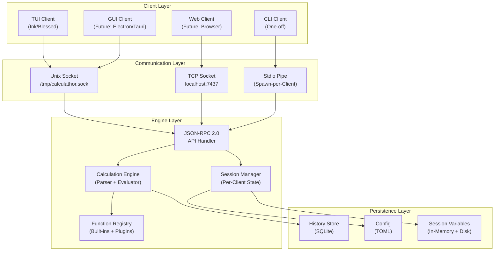
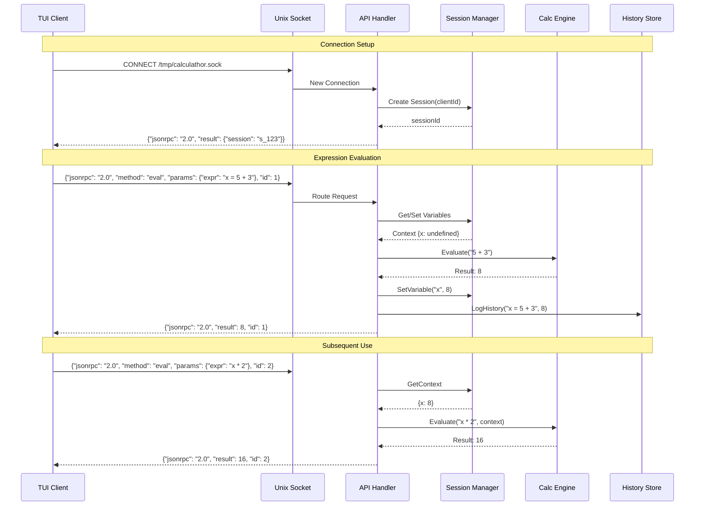
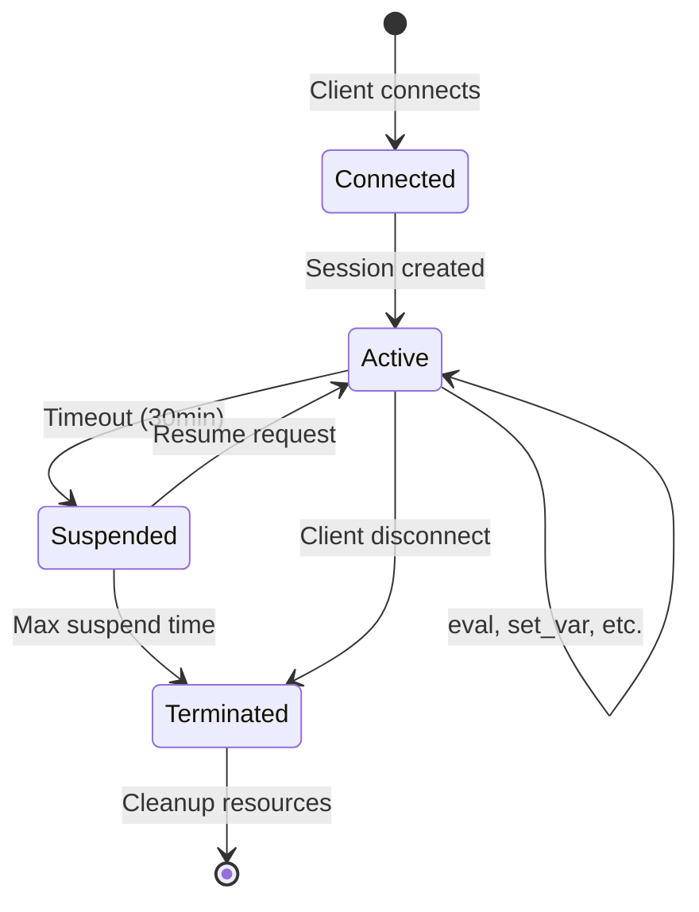
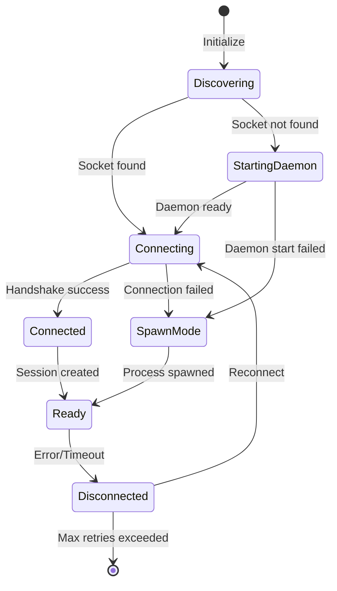

# Calculathor Multi-Client Architecture Research

> **Project**: Calculathor - Multi-Client Calculator Engine
> **Focus**: Core Engine + Client Communication Architecture
> **Status**: Research Phase - Decision Document

---

## 1. Executive Summary

This document analyzes architectural options for Calculathor's multi-client design, evaluating communication mechanisms, process models, and protocol choices. The recommended architecture uses a **daemon-based engine with Unix domain sockets (TCP fallback)** and a **stateful session model** with **JSON-RPC 2.0** protocol.

**Key Decision**: Hybrid daemon model - long-running engine with per-client session state, optimized for the TUI-first MVP while supporting future GUI/web clients.

---

## 2. Architecture Overview

### 2.1 High-Level Component Diagram (C4 - Level 2: Container)



### 2.2 Component Responsibilities

| Component | Responsibility | Technology |
|-----------|---------------|------------|
| **Calculation Engine** | Expression parsing, evaluation, math operations | TypeScript (Pratt parser) |
| **Session Manager** | Per-client variable scope, history tracking | In-memory + SQLite |
| **Function Registry** | Built-in functions, user-defined functions, plugins | Registry pattern |
| **API Handler** | Protocol parsing, request routing, error handling | JSON-RPC 2.0 |
| **Transport Layer** | Socket management, connection handling, stdio bridge | Bun native APIs |

### 2.3 Sequence Diagram: Expression Evaluation



---

## 3. Communication Options Analysis

### 3.1 Evaluation Matrix

| Mechanism | Latency | Complexity | Cross-Platform | Multi-Client | Startup | Score |
|-----------|---------|------------|----------------|--------------|---------|-------|
| **Stdio IPC** | Low | Low | Excellent | No | Per-call | 6/10 |
| **Unix Sockets** | Very Low | Low | Unix only* | Yes | Daemon | 9/10 |
| **Named Pipes** | Low | Medium | Windows only* | Yes | Daemon | 5/10 |
| **TCP Sockets** | Low | Low | Excellent | Yes | Daemon | 8/10 |
| **gRPC** | Low | High | Excellent | Yes | Daemon | 7/10 |
| **Shared Memory** | Lowest | High | Poor | Yes | Daemon | 4/10 |

\* Unix sockets available on Windows 10+ via WSL, but named pipes are native Windows IPC.

### 3.2 Detailed Analysis

#### Option 1: Stdio IPC (Spawn-Per-Client)

**Mechanism**: Spawn engine process per client, communicate via stdin/stdout using line-delimited JSON.

```typescript
// Client spawns: calculathor-engine --stdio
// Communication:
// Client -> stdin:  {"method": "eval", "params": {"expr": "1+1"}}
// Engine -> stdout: {"result": 2}
```

**Pros**:
- Simple implementation
- No daemon management needed
- Natural fit for CLI one-off calculations
- Process isolation (crash doesn't affect other clients)

**Cons**:
- High per-client memory (~10-20MB per Node.js process)
- Slow startup (~50-100ms Node.js init)
- No shared state between clients
- History/variables not persisted across calls

**Verdict**: Suitable for CLI client only, not for multi-client architecture.

---

#### Option 2: Unix Domain Sockets (Recommended Primary)

**Mechanism**: Single daemon process listens on Unix socket file (e.g., `/tmp/calculathor.sock`).

```typescript
// Server using Bun.listen()
const server = Bun.listen({
  unix: '/tmp/calculathor.sock',
  socket: {
    data(socket, data) {
      handleRequest(data);
    },
    open(socket) {
      console.log('Client connected');
    },
    close(socket) {
      console.log('Client disconnected');
    },
  },
});

// Client using Bun.connect()
const client = await Bun.connect({
  unix: '/tmp/calculathor.sock',
  socket: {
    data(socket, data) {
      console.log('Received:', data.toString());
    },
    open(socket) {
      socket.write(JSON.stringify(request));
    },
    close(socket) {
      console.log('Connection closed');
    },
  },
});
```

**Pros**:
- Very low latency (kernel-bypass on some systems)
- File-based discovery (check if socket exists)
- Permission control via filesystem
- Works well with process managers (systemd socket activation)
- Supports passing file descriptors (future: for plugin loading)

**Cons**:
- Unix-only (though Windows 10+ has AF_UNIX support)
- Socket file cleanup required on crash
- Path length limitations on some systems

**Performance**: ~0.1ms round-trip for simple requests.

**Verdict**: Primary choice for Unix-like systems (Linux, macOS, WSL).

---

#### Option 3: Named Pipes (Windows)

**Mechanism**: Windows named pipe at `\\.\pipe\calculathor`.

**Pros**:
- Native Windows IPC
- Supports message framing
- Can set security descriptors

**Cons**:
- Windows only
- More complex API
- Requires separate implementation path

**Verdict**: Windows-specific implementation detail, not primary choice.

---

#### Option 4: TCP Sockets (Recommended Fallback)

**Mechanism**: Daemon listens on localhost TCP port (default: 7437 - "CALC" on phone keypad).

```typescript
// Server using Bun.listen()
const server = Bun.listen({
  hostname: '127.0.0.1',
  port: 7437,
  socket: {
    data(socket, data) {
      handleRequest(data);
    },
    open(socket) {
      console.log('Client connected from', socket.remoteAddress);
    },
    close(socket) {
      console.log('Client disconnected');
    },
  },
});
```

**Pros**:
- Universal support (all platforms)
- Network-transparent (future: remote engine)
- Well-understood, easy to debug (telnet, netcat)
- No file cleanup needed

**Cons**:
- Firewall warnings on some systems
- Port conflicts possible
- Slightly higher latency than Unix sockets (~0.2ms vs ~0.1ms)
- Security considerations (must bind to localhost only)

**Verdict**: Fallback for Windows and environments without Unix socket support.

---

#### Option 5: gRPC

**Mechanism**: Protocol Buffers over HTTP/2 with generated client/server code.

```protobuf
service Calculathor {
  rpc Evaluate(Expression) returns (Result);
  rpc StreamCalculate(stream Expression) returns (stream Result);
}
```

**Pros**:
- Strong typing via protobuf
- Streaming support
- Code generation
- Middleware ecosystem

**Cons**:
- Heavy dependency (~10MB+ added)
- Complex build process (proto compilation)
- Requires HTTP/2
- Overkill for simple calculator operations

**Verdict**: Not recommended for MVP - consider for future enterprise features.

---

#### Option 6: Shared Memory

**Mechanism**: Memory-mapped files for zero-copy communication.

**Pros**:
- Fastest possible IPC
- Zero-copy for large data

**Cons**:
- Extremely complex synchronization
- Platform-specific APIs
- Difficult debugging
- Not suitable for request-response pattern

**Verdict**: Not appropriate for this use case.

---

## 4. Protocol Design Recommendation

### 4.1 Chosen Protocol: JSON-RPC 2.0

**Rationale**:
- Human-readable (easy debugging)
- Batching support (multiple requests)
- Established error handling
- No schema compilation required
- Universal JSON support in all languages

### 4.2 Protocol Specification

```typescript
// Base types
interface JSONRPCRequest {
  jsonrpc: "2.0";
  method: string;
  params?: unknown;
  id?: string | number | null;
}

interface JSONRPCResponse {
  jsonrpc: "2.0";
  result?: unknown;
  error?: JSONRPCError;
  id: string | number | null;
}

interface JSONRPCError {
  code: number;
  message: string;
  data?: unknown;
}
```

### 4.3 Method Reference

| Method | Description | Params | Returns |
|--------|-------------|--------|---------|
| `eval` | Evaluate expression | `{expr: string}` | `number \| string` |
| `eval_batch` | Evaluate multiple | `{exprs: string[]}` | `Array<result \| error>` |
| `get_var` | Get variable value | `{name: string}` | `unknown` |
| `set_var` | Set variable | `{name: string, value: unknown}` | `null` |
| `get_vars` | List all variables | `{}` | `Record<string, unknown>` |
| `clear_vars` | Clear session variables | `{}` | `null` |
| `get_history` | Get calculation history | `{limit?: number}` | `HistoryEntry[]` |
| `define_func` | Define user function | `{name: string, params: string[], body: string}` | `null` |
| `get_funcs` | List defined functions | `{}` | `FunctionDef[]` |
| `ping` | Health check | `{}` | `"pong"` |
| `get_version` | Get engine version | `{}` | `{version: string}` |

### 4.4 Example Messages

```json
// Request: Simple evaluation
{"jsonrpc": "2.0", "method": "eval", "params": {"expr": "2 + 2"}, "id": 1}

// Response: Success
{"jsonrpc": "2.0", "result": 4, "id": 1}

// Request: Set variable
{"jsonrpc": "2.0", "method": "set_var", "params": {"name": "pi", "value": 3.14159}, "id": 2}

// Response: Success
{"jsonrpc": "2.0", "result": null, "id": 2}

// Request: Invalid expression
{"jsonrpc": "2.0", "method": "eval", "params": {"expr": "1/0"}, "id": 3}

// Response: Error
{"jsonrpc": "2.0", "error": {"code": -32000, "message": "Division by zero", "data": {"expr": "1/0"}}, "id": 3}

// Request: Batch (no id = notification, no response)
{"jsonrpc": "2.0", "method": "clear_vars", "params": {}}
```

### 4.5 Error Codes

| Code | Meaning | Usage |
|------|---------|-------|
| `-32700` | Parse error | Invalid JSON |
| `-32600` | Invalid request | Malformed JSON-RPC |
| `-32601` | Method not found | Unknown method |
| `-32602` | Invalid params | Wrong parameters |
| `-32603` | Internal error | Engine crash |
| `-32000` | Calculation error | Math errors (div/0, etc.) |
| `-32001` | Undefined variable | Variable not found |
| `-32002` | Invalid expression | Parse error in expression |

---

## 5. State Management Approach

### 5.1 Decision: Stateful Sessions with Persistence

Each client connection gets an isolated session with:
- Variable scope (per-session variables)
- Function definitions (user-defined)
- Calculation history
- Settings overrides

### 5.2 State Architecture

```
┌─────────────────────────────────────────────┐
│              Engine Process                  │
│  ┌───────────────────────────────────────┐  │
│  │         Session Manager                │  │
│  │  ┌─────────┐ ┌─────────┐ ┌─────────┐  │  │
│  │  │Session A│ │Session B│ │Session C│  │  │
│  │  │- vars   │ │- vars   │ │- vars   │  │  │
│  │  │- funcs  │ │- funcs  │ │- funcs  │  │  │
│  │  │- history│ │- history│ │- history│  │  │
│  │  └─────────┘ └─────────┘ └─────────┘  │  │
│  └───────────────────────────────────────┘  │
│  ┌───────────────────────────────────────┐  │
│  │       Shared State (Global)            │  │
│  │  - Built-in functions                  │  │
│  │  - Constants (pi, e)                   │  │
│  │  - Unit definitions                    │  │
│  │  - Plugin registry                     │  │
│  └───────────────────────────────────────┘  │
└─────────────────────────────────────────────┘
```

### 5.3 Session Lifecycle



### 5.4 Persistence Strategy

| Data | Storage | Persistence | Notes |
|------|---------|-------------|-------|
| Session variables | Memory + SQLite | Optional | Auto-save every 30s |
| History | SQLite | Immediate | Global + per-session |
| User functions | SQLite | On definition | Global scope |
| Settings | TOML file | On change | Reload on SIGUSR1 |

### 5.5 Concurrency Model

- **Engine**: Single-threaded event loop (Bun runtime)
- **Sessions**: Isolated object instances
- **Shared state**: Read-heavy, copy-on-write for modifications
- **SQLite**: Serialized writes via connection queue

---

## 6. Process Model: Daemon vs Spawn-Per-Client

### 6.1 Decision: Hybrid Model

| Client Type | Mode | Rationale |
|-------------|------|-----------|
| **TUI** | Daemon | Long-running, needs state persistence |
| **GUI** | Daemon | Long-running, shares state with TUI |
| **CLI** | Spawn-per-client (fallback to daemon) | Fast one-off calculations |
| **Web** | Daemon | Long-running connections |

### 6.2 Daemon Mode Details

**Startup**: Auto-start on first client connection via socket activation pattern. When compiled as a single binary with `bun build --compile`, the daemon spawns itself using `process.execPath`.

```bash
# Socket activation flow
1. Client attempts connection to /tmp/calculathor.sock
2. If socket doesn't exist:
   a. Spawn daemon using process.execPath: `process.execPath + " --daemon"`
   b. Wait for socket creation (timeout: 5s)
   c. Retry connection
3. If socket exists but no response:
   a. Stale socket detected
   b. Remove socket, restart daemon
```

```typescript
// Single binary daemon auto-spawn
async function ensureDaemonRunning(): Promise<void> {
  const socketPath = getSocketPath();

  // Check if daemon is already running
  if (await isDaemonRunning(socketPath)) {
    return;
  }

  // Remove stale socket if exists
  if (await Bun.file(socketPath).exists()) {
    await Bun.file(socketPath).delete();
  }

  // Spawn daemon using process.execPath (works for both bun and compiled binary)
  const proc = Bun.spawn([process.execPath, '--daemon'], {
    detached: true,
    stdio: ['ignore', 'ignore', 'ignore'],
  });

  // Wait for socket to be created
  await waitForSocket(socketPath, 5000);
}

// For compiled binaries (bun build --compile):
// process.execPath points to the compiled binary itself
// This allows the single binary to spawn itself as a daemon
```

**Shutdown**: Graceful shutdown on last client disconnect + idle timeout (5 minutes).

**Monitoring**: Built-in health endpoint (`ping` method) for process managers.

### 6.3 CLI Spawn Mode

For simple calculations without daemon:

```bash
# Direct mode (no daemon)
calculathor eval "1 + 1"

# Auto-detects complexity, uses daemon for:
# - Multi-line input
# - Variable definitions
# - File input
calculathor eval "x = 5; x * 2"  # Uses daemon
calculathor eval "1+1"            # Spawn mode (faster)
```

---

## 7. Client Discovery & Connection

### 7.1 Discovery Mechanism

Unix socket path resolution (in priority order):

1. `CALCULATHOR_SOCKET` environment variable
2. XDG runtime directory: `$XDG_RUNTIME_DIR/calculathor/socket`
3. Standard locations:
   - macOS: `~/Library/Caches/calculathor/socket`
   - Linux: `/tmp/calculathor-$UID/socket`
   - Windows: `\\.\pipe\calculathor-$USERNAME`

### 7.2 Connection Protocol

```typescript
interface ConnectionOptions {
  // Auto-detected if not specified
  transport?: 'unix' | 'tcp' | 'pipe';

  // For TCP mode
  host?: string;  // default: 127.0.0.1
  port?: number;  // default: 7437

  // For Unix socket
  socketPath?: string;

  // Behavior
  autoStartDaemon?: boolean;  // default: true
  timeout?: number;           // default: 5000ms
}
```

### 7.3 Connection State Machine



---

## 8. Architecture Decision Records

### ADR-001: Daemon vs Spawn-Per-Client

**Status**: Accepted
**Date**: 2026-02-14
**Deciders**: System Architect

#### Context
Calculathor needs to support multiple client types (TUI, CLI, GUI, web). We need to decide whether to use a long-running daemon process or spawn an engine per client connection.

#### Decision
Use a **hybrid model**:
- Daemon mode for TUI, GUI, and web clients (stateful, long-running)
- Spawn-per-client for simple CLI calculations (stateless, one-off)

#### Consequences

**Positive**:
- TUI clients get fast response times (<5ms) after initial connection
- Shared history and variables across sessions
- Lower total memory usage for multiple clients
- Consistent state for complex calculations

**Negative**:
- Additional complexity (daemon management, socket cleanup)
- Potential for daemon crashes affecting all clients
- Need for process monitoring and auto-restart

#### Mitigations
- Implement graceful error recovery (daemon crash = auto-restart)
- Provide `--no-daemon` flag for isolated usage
- Add health checks and watchdog

---

### ADR-002: Communication Transport

**Status**: Accepted
**Date**: 2026-02-14
**Deciders**: System Architect

#### Context
Need to select IPC mechanism for client-engine communication.

#### Decision
**Primary**: Unix domain sockets (on Unix-like systems)
**Fallback**: TCP sockets on localhost (port 7437)
**CLI**: Stdio pipes for spawn-per-client mode

#### Consequences

**Positive**:
- Unix sockets offer lowest latency with simple API
- TCP provides universal fallback
- Stdio mode keeps CLI simple

**Negative**:
- Two transport implementations to maintain
- Windows requires TCP fallback (no native Unix sockets in older versions)

---

### ADR-003: Protocol Format

**Status**: Accepted
**Date**: 2026-02-14
**Deciders**: System Architect

#### Context
Need a protocol for client-engine communication. Options: custom binary, gRPC, JSON-RPC, GraphQL.

#### Decision
Use **JSON-RPC 2.0** over line-delimited JSON (newline as message separator).

#### Consequences

**Positive**:
- Human-readable, easy to debug with `nc` or `telnet`
- No code generation required
- Simple to implement
- Built-in batching support

**Negative**:
- Higher overhead than binary (acceptable for calculator use case)
- No streaming support (can add `eval_stream` method later if needed)

#### Alternatives Considered
- **gRPC**: Rejected due to dependency weight and build complexity
- **Custom binary**: Rejected due to debugging difficulty
- **GraphQL**: Rejected as overkill for simple RPC pattern

---

### ADR-004: State Management Model

**Status**: Accepted
**Date**: 2026-02-14
**Deciders**: System Architect

#### Context
Decide between stateless (each request contains all context) and stateful (server maintains session state).

#### Decision
**Stateful sessions** with per-client isolation.

Each connection gets:
- Private variable scope
- Private function definitions
- Isolated calculation history
- Session timeout after 30 minutes idle

#### Consequences

**Positive**:
- Natural fit for calculator workflow (variables persist)
- Smaller message payloads
- Multiple independent users can share engine

**Negative**:
- Memory usage grows with number of sessions
- Need session cleanup/garbage collection
- Client must handle reconnection (restore state)

#### Mitigations
- Session timeout with auto-cleanup
- Optional session persistence to SQLite
- Client libraries handle reconnection transparently

---

## 9. Implementation Roadmap

### Phase 1: Core Engine (Week 1-2)
- [ ] Implement JSON-RPC 2.0 protocol handler
- [ ] Add Unix socket transport
- [ ] Add TCP socket transport
- [ ] Implement session manager
- [ ] Add daemon lifecycle management

### Phase 2: Client SDK (Week 3)
- [ ] Create client library (`@calculathor/sdk`)
- [ ] Connection management with auto-reconnect
- [ ] Method wrappers with TypeScript types
- [ ] Error handling utilities

### Phase 3: TUI Integration (Week 4)
- [ ] TUI client using SDK
- [ ] Session persistence
- [ ] Variable display panel
- [ ] History navigation

### Phase 4: CLI Enhancement (Week 5)
- [ ] Direct spawn mode for simple evals
- [ ] Daemon auto-start for complex operations
- [ ] Batch mode support

---

## 10. Security Considerations

### 10.1 Threat Model

| Threat | Mitigation |
|--------|------------|
| Unauthorized access | Unix socket permissions (0600), TCP bind to localhost only |
| Resource exhaustion | Request timeouts, max session limits, memory caps |
| Injection attacks | Input validation, expression sandboxing |
| DoS via long calculations | Execution timeouts, CPU limits |

### 10.2 Sandboxing

- Expression evaluation runs in isolated context (no access to runtime globals)
- Plugin system uses VM2 or similar sandbox for user scripts
- File system access limited to specific directories (config, history)

---

## 11. Performance Targets

| Metric | Target | Measurement |
|--------|--------|-------------|
| Connection establishment | <10ms | Socket connect + handshake |
| Simple expression eval | <1ms | `2 + 2` round-trip |
| Complex expression eval | <10ms | `sin(cos(tan(pi/4)))` |
| Session creation | <5ms | New client connection |
| Memory per session | <100KB | Variables + history |
| Daemon startup | <100ms | Process init to ready |

---

## 12. References

- [JSON-RPC 2.0 Specification](https://www.jsonrpc.org/specification)
- [Bun TCP Sockets Documentation](https://bun.sh/docs/api/tcp)
- [Bun File I/O Documentation](https://bun.sh/docs/api/file-io)
- [Bun Build --compile Documentation](https://bun.sh/docs/bundler/executables)
- [XDG Base Directory Specification](https://specifications.freedesktop.org/basedir-spec/basedir-spec-latest.html)
- [C4 Model for Architecture Diagrams](https://c4model.com/)

---

**Next Steps**:
1. Review architecture with team
2. Create proof-of-concept for transport layer
3. Define SDK interface
4. Begin engine implementation

**Document Version**: 1.0
**Last Updated**: 2026-02-14
